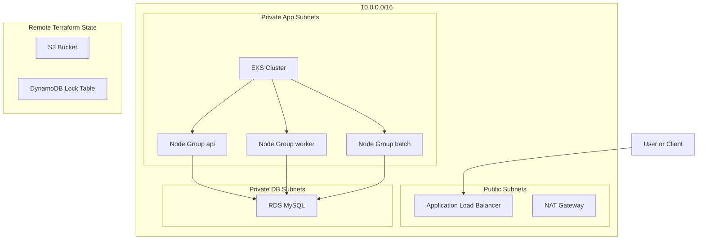
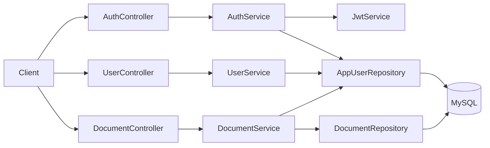
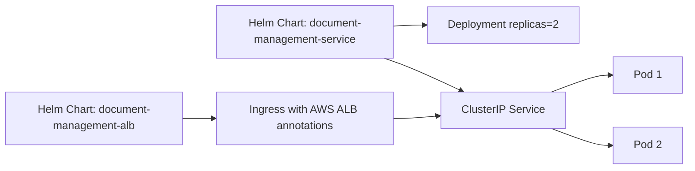
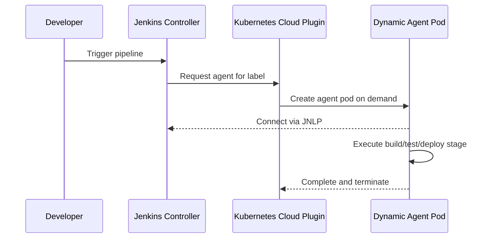

Author: Arunasalam Govindasamy

# Terraform Labs — Architecture Command Center

> A high-clarity, architecture-first repository for AWS infrastructure, Java service design, Kubernetes runtime, and dynamic Jenkins delivery.

<table>
  <tr>
    <td align="center" width="25%">
      
       
      <strong>Infrastructure Architecture</strong> 
      VPC, EKS, RDS, ALB, state backend
    </td>
    <td align="center" width="25%">
      
       
      <strong>Application Design</strong> 
      Service boundaries, domain, API, security
    </td>
    <td align="center" width="25%">
      
       
      <strong>Kubernetes Runtime</strong> 
      Helm deployment model, ALB ingress
    </td>
    <td align="center" width="25%">
      
       
      <strong>Delivery Platform</strong> 
      Dynamic agents, pipeline runtime
    </td>
  </tr>
</table>

## Read by Folder

- Infrastructure details: [terraform/README.md](terraform/README.md)
- Application architecture: [applications/README.md](applications/README.md)
- Kubernetes deployment model: [k8s/README.md](k8s/README.md)
- CI/CD delivery model: [jenkins/README.md](jenkins/README.md)

---

## Infrastructure Architecture (Default View)

This is the default section because platform reliability starts at infrastructure quality.

### Why this design is strong

1. Network segmentation by intent: public ingress, private compute, isolated database.
2. Security-group-to-security-group traffic control instead of open CIDR rules.
3. Stateful components isolated from pod churn.
4. Remote Terraform state with locking to prevent destructive concurrency.

### Quick infra outcomes

- Internet entry is only via ALB.
- Workloads run in private subnets.
- Database is private and not internet-addressable.
- State operations are controlled and recoverable.

---

## Application Design

The application is a Spring Boot document-management API with authentication, user lifecycle, and document ingestion/download capability.

Open full design: [applications/README.md](applications/README.md)

---

## Kubernetes Runtime

The EKS runtime is split into two Helm concerns for scale and ownership clarity.

Open full runtime guide: [k8s/README.md](k8s/README.md)

---

## Delivery Platform (Jenkins)

Jenkins is deployed through a dedicated Helm chart and configured to run builds on dynamic Kubernetes agents.

Open full delivery guide: [jenkins/README.md](jenkins/README.md)

---

## Growth Model

This documentation is intentionally structured to grow:

1. Add a new architecture card in one line at the top table.
2. Add a new section in this README and link to its folder README.
3. Keep detailed implementation in folder-level READMEs.

For reviewers and architects, this root file should remain the main entry point.
