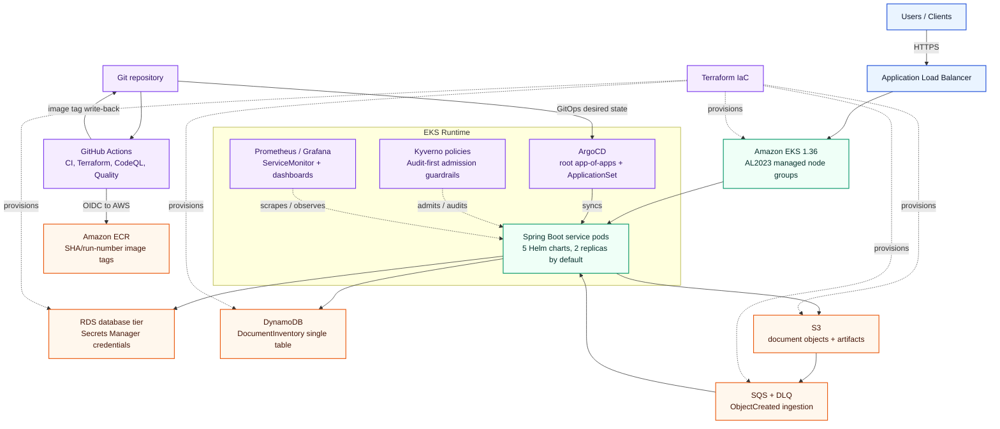
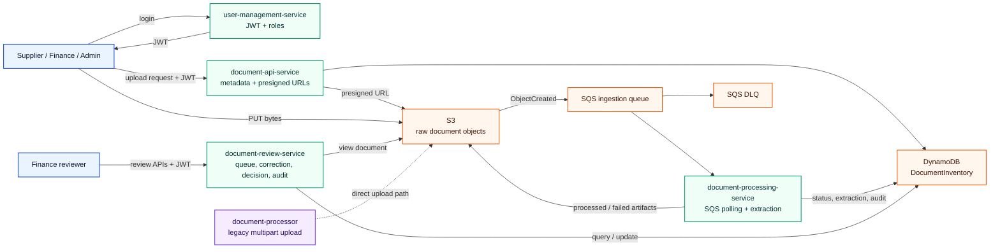
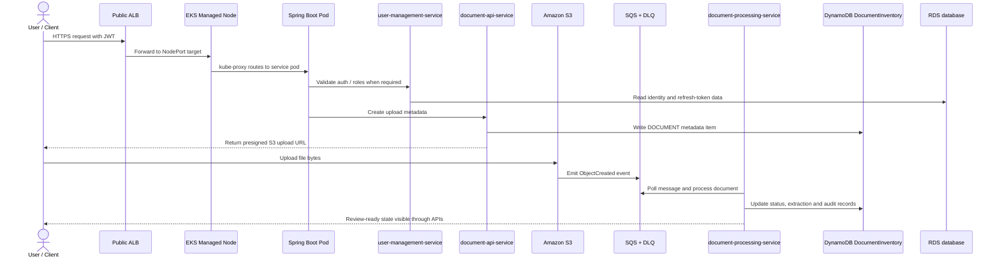
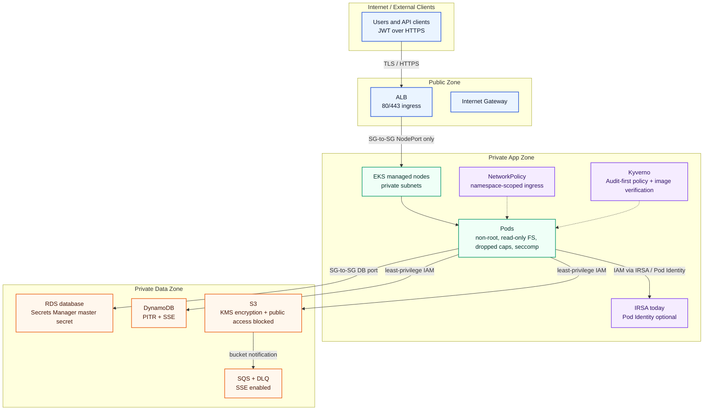

Author: Arunasalam Govindasamy

# Terraform Labs — Enterprise Architecture Command Center

> A portfolio-grade reference platform by **Arunasalam Govindasamy**, Senior Cloud & Solutions Architect. It shows how to design and deliver an enterprise system end to end: AWS infrastructure, Spring Boot services, EKS platform engineering, secure GitHub Actions delivery, GitOps, policy, and observability.

This repository is intentionally honest about scope. It contains **5 service modules**: 4 implemented services in the primary document workflow plus 1 legacy/transitional upload service. GitHub Actions is the active CI/CD path; Jenkins is retained as a frozen legacy reference.

---

## 🎯 Quick Navigation

Explore five core domains of this architecture. **Click any box below to dive into detailed documentation:**

<table>
  <tr>
    <td align="center" width="20%">
      <h3>🏗️ Infrastructure</h3>
      <p>AWS VPC, EKS 1.36, RDS, S3, DynamoDB, SQS</p>
      <p><strong><a href="terraform/README.md">→ View Full Guide</a></strong></p>
      <p style="font-size: 0.9em;">Multi-AZ networking, AL2023 managed nodes, IAM, state, secrets</p>
    </td>
    <td align="center" width="20%">
      <h3>📱 Application</h3>
      <p>Spring Boot Services, Events, APIs</p>
      <p><strong><a href="applications/README.md">→ View Full Guide</a></strong></p>
      <p style="font-size: 0.9em;">Identity, intake, async processing, review, audit</p>
    </td>
    <td align="center" width="20%">
      <h3>⚙️ Kubernetes</h3>
      <p>EKS Runtime, Helm Charts, Policy</p>
      <p><strong><a href="k8s/README.md">→ View Full Guide</a></strong></p>
      <p style="font-size: 0.9em;">Service charts, security contexts, NetworkPolicy, ServiceMonitor</p>
    </td>
    <td align="center" width="20%">
      <h3>🚀 Delivery</h3>
      <p>GitHub Actions, ArgoCD GitOps, Supply Chain</p>
      <p><strong><a href="cicd/README.md">→ View Full Guide</a></strong></p>
      <p style="font-size: 0.9em;">OIDC, build/test, Trivy, SBOM, cosign, app-of-apps</p>
    </td>
    <td align="center" width="20%">
      <h3>📡 Observability</h3>
      <p>Metrics, Traces, Logs, Alerting</p>
      <p><strong><a href="observability/README.md">→ View Full Guide</a></strong></p>
      <p style="font-size: 0.9em;">Prometheus, ServiceMonitor, OTLP, correlation IDs, runbooks</p>
    </td>
  </tr>
</table>

---

## 💡 Why This Architecture?

The platform models a realistic enterprise document-processing system: identity and authorization, secure document intake, asynchronous processing, finance review, auditability, and an AWS/EKS delivery platform around it.



Caption: System context for the full platform, including runtime traffic, data services, IaC ownership, and the active GitHub Actions to ArgoCD delivery loop.

---

## 📚 What's Inside

| Folder | Purpose | Documentation |
|--------|---------|-----------------|
| `terraform/` | Infrastructure-as-Code for AWS: VPC, EKS, IAM, ECR, S3, SQS, DynamoDB, RDS | [Full Terraform Guide](terraform/README.md) |
| `applications/` | Spring Boot microservices architecture, API contracts, workflow and data model | [Full Application Guide](applications/README.md) |
| `k8s/` | EKS Helm charts, runtime hardening, ArgoCD install chart, deployment scripts | [Full Kubernetes Guide](k8s/README.md) |
| `cicd/` | GitHub Actions delivery, ArgoCD GitOps manifests, legacy Jenkins references | [Full Delivery Guide](cicd/README.md) |
| `observability/` | Metrics, tracing, structured logging, dashboards, alerting and verification runbooks | [Full Observability Guide](observability/README.md) |

---

## 🧭 Architectural Principles

| Principle | How it appears in this repo |
|-----------|------------------------------|
| Least-privilege boundaries | SG-to-SG rules between ALB, EKS nodes, control plane and RDS; no direct database exposure. |
| Git as delivery source of truth | ArgoCD root app-of-apps and ApplicationSet reconcile cluster state from Git. |
| CI builds, CD reconciles | GitHub Actions builds/tests/scans/signs and writes image tags; ArgoCD performs deployment. |
| Traceable and attestable artifacts | SHA/run-number image tags, Trivy scans, CycloneDX SBOMs, cosign keyless signatures and SLSA provenance. |
| Runtime defense in depth | Non-root pods, read-only root filesystems, dropped capabilities, seccomp, NetworkPolicy and Kyverno policies. |
| Multi-AZ isolation with cost controls | 3 AZs and 3 subnet tiers, with t3.micro defaults and optional single NAT gateway for lower-cost environments. |
| Migration paths over big-bang rewrites | IRSA remains default; EKS Pod Identity and Karpenter are available behind flags for controlled adoption. |

---

## 🧩 What This Repository Demonstrates

| Capability | Evidence in repo | Proof path |
|------------|------------------|------------|
| Cloud infrastructure | Modular VPC, EKS, RDS, S3, SQS, DynamoDB and ECR provisioning | [terraform/main.tf](terraform/main.tf), [terraform/modules/](terraform/modules) |
| Networking architecture | 3-tier VPC across eu-west-1a/b/c with public, private-app and private-db subnets | [terraform/terraform.tfvars](terraform/terraform.tfvars), [terraform/README.md](terraform/README.md) |
| Kubernetes platform | 5 service Helm charts, AL2023 managed node groups, managed addons, ServiceMonitors | [k8s/eks](k8s/eks), [terraform/modules/eks/main.tf](terraform/modules/eks/main.tf) |
| Security engineering | IRSA, EKS Access Entries, Secrets Manager credentials, Kyverno, hardened pod defaults | [terraform/main.tf](terraform/main.tf), [terraform/eks-modernization.tf](terraform/eks-modernization.tf), [k8s/policy/kyverno](k8s/policy/kyverno) |
| Application engineering | Identity, intake, processing, review and legacy upload service modules | [applications/README.md](applications/README.md), [applications](applications) |
| Event-driven design | S3 ObjectCreated events into SQS + DLQ, processing service, DynamoDB workflow state | [applications/document-processing-service/README.md](applications/document-processing-service/README.md), [terraform/main.tf](terraform/main.tf) |
| CI/CD and supply chain | 4 GitHub Actions workflows with build/test, Terraform plan, CodeQL, gitleaks, actionlint, Helm and kubeconform | [.github/workflows](.github/workflows) |
| Observability | Prometheus ServiceMonitors, OTLP tracing, structured logs with trace/span/correlation IDs | [observability/README.md](observability/README.md), [applications](applications) |
| Cost and FinOps | Free-tier-friendly defaults: t3.micro nodes, db.t3.micro RDS, PAY_PER_REQUEST DynamoDB, configurable NAT | [terraform/terraform.tfvars](terraform/terraform.tfvars), [terraform/README.md](terraform/README.md) |

---

## 📱 Application Architecture at a Glance

The primary workflow is implemented by 4 services: `user-management-service`, `document-api-service`, `document-processing-service` and `document-review-service`. `document-processor` remains a transitional standalone S3 upload path.



Caption: Service map for the document workflow, including JWT identity, presigned S3 upload, S3-to-SQS event ingestion, DynamoDB state and review APIs.

---

## ⚙️ Runtime Orchestration

EKS runs private control-plane access, AL2023 managed node groups and managed addons for `vpc-cni`, `coredns`, `kube-proxy`, `aws-ebs-csi-driver` and `eks-pod-identity-agent`. Each service chart defaults to **2 replicas**, hardened security contexts and configurable topology spread constraints.



Caption: High-level runtime sequence from ingress through authentication, presigned upload and asynchronous document processing.

---

## 🚀 Delivery

GitHub Actions is the active CI/CD system. Jenkinsfiles and the Jenkins chart remain in the repo as a frozen legacy reference, not the live delivery path.

```mermaid
%%{init: {'theme':'default','flowchart':{'useMaxWidth':true,'htmlLabels':true}}}%%
flowchart LR
  classDef edge fill:#EAF4FF,stroke:#1D4ED8,color:#0F172A,stroke-width:1.5px;
  classDef runtime fill:#EFFFF7,stroke:#059669,color:#052E2B,stroke-width:1.5px;
  classDef data fill:#FFF7ED,stroke:#EA580C,color:#431407,stroke-width:1.5px;
  classDef control fill:#F5ECFF,stroke:#7C3AED,color:#2E1065,stroke-width:1.5px;
  classDef legacy fill:#F8FAFC,stroke:#94A3B8,color:#475569,stroke-width:1px,stroke-dasharray: 5 5;

  Dev["Developer"]:::edge --> PR["Pull Request / main push"]:::control
  PR --> GHA["GitHub Actions\nCI Services matrix"]:::control
  GHA --> Test["Maven verify"]:::control
  Test --> Build["Docker Buildx image build"]:::control
  Build --> Trivy["Trivy HIGH/CRITICAL gate\nSARIF upload"]:::control
  Trivy --> SBOM["CycloneDX SBOM"]:::control
  SBOM --> Cosign["cosign keyless sign\nSBOM attestation + SLSA provenance"]:::control
  Cosign -->|GitHub OIDC to AWS| ECR["Amazon ECR"]:::data
  Cosign --> WriteBack["yq image-tag write-back\n[skip ci] commit"]:::control
  WriteBack --> Git["Git desired state"]:::control
  Git --> ArgoCD["ArgoCD root app + ApplicationSet"]:::control
  ArgoCD --> Kyverno["Kyverno admission policies"]:::control
  Kyverno --> EKS["EKS workloads"]:::runtime
  Jenkins["Jenkins legacy reference\nfrozen, not active CI/CD"]:::legacy -.-> Git
```



Caption: Active delivery and supply-chain flow: GitHub Actions builds, scans, signs and writes image tags; ArgoCD reconciles Git to EKS with Kyverno policy checks.

| Workflow | Purpose |
|----------|---------|
| `ci-services.yml` | Matrix build/test/push for 5 service modules, Trivy image scan, SBOM, cosign signing and GitOps tag write-back. |
| `terraform.yml` | Terraform fmt/validate/tflint/Trivy config scan/plan on PRs and manual apply through an environment gate. |
| `codeql.yml` | CodeQL Java analysis and gitleaks secret scanning. |
| `quality.yml` | actionlint, Helm lint, Helm render and kubeconform validation. |

---

## ⚖️ Key Design Decisions & Trade-offs

| Decision | Alternative considered | Why this choice |
|----------|------------------------|-----------------|
| EKS managed node groups on AL2023 | Self-managed AL2 nodes and bootstrap scripts | Reduces undifferentiated lifecycle work, tracks supported AMIs and keeps node rollout in Terraform. |
| ArgoCD GitOps deployment | CI push-deploy directly to the cluster | Keeps deployment state auditable in Git and separates artifact creation from reconciliation. |
| GitHub Actions as active CI/CD | Jenkins as the live pipeline | Actions integrates OIDC, code scanning, SARIF, provenance and repository-native PR feedback; Jenkins remains a migration/reference artifact. |
| Optional Karpenter | Cluster Autoscaler only | Default node groups stay simple and cost-aware; Karpenter is available for faster, more flexible capacity when needed. |
| IRSA default with Pod Identity flag | Immediate migration to Pod Identity | Preserves a proven identity path while enabling controlled Pod Identity validation by environment. |
| DynamoDB single-table workflow state | Relational document workflow schema | Fits high-volume document state transitions, GSI access patterns and event-driven processing without joins. |
| S3 ObjectCreated to SQS + DLQ | Synchronous processing at upload time | Decouples upload latency from extraction work and creates a failure boundary for retries and dead-letter handling. |
| cosign keyless signing | Long-lived signing keys | Uses GitHub OIDC/Sigstore identity, avoiding private signing key custody in CI. |

---

## 🛡️ Security & Supply-Chain Posture



Caption: Layered trust boundaries from the public edge to private application and data tiers, with identity, policy and encryption controls at each hop.

| Control area | Implementation |
|--------------|----------------|
| CI identity | GitHub OIDC federation for AWS access; no static AWS keys in workflows. |
| Workload identity | IRSA roles scoped by Kubernetes service account; EKS Pod Identity available behind `use_pod_identity`. |
| Cluster access | EKS Access Entries for admin/CI principals, with `API_AND_CONFIG_MAP` as migration mode. |
| Runtime hardening | Non-root containers, read-only root filesystem, dropped capabilities, seccomp and resource requests/limits. |
| Admission policy | Kyverno policies for security context, resources, no `:latest`, IRSA annotation and cosign verification. |
| Supply chain | Trivy gating, SARIF upload, CycloneDX SBOM, cosign keyless signing, SLSA provenance, CodeQL and gitleaks. |
| Secrets | RDS master credentials managed in AWS Secrets Manager; Terraform no longer requires a plaintext DB password variable. |
| State and data | Terraform state in encrypted S3 with DynamoDB locking; application data encrypted via RDS/S3/DynamoDB/SQS controls. |

---

## 📊 Key Metrics

| Aspect | Value | Source of truth |
|--------|-------|-----------------|
| **Application modules** | 5 total: 4 primary workflow services + 1 legacy upload path | `applications/*/README.md` |
| **Service Helm charts** | 5 | `k8s/eks/*` |
| **Default replicas** | 2 per service chart | `k8s/eks/*/values.yaml` |
| **Availability Zones** | 3 (`eu-west-1a`, `eu-west-1b`, `eu-west-1c`) | `terraform/terraform.tfvars` |
| **Network tiers** | 3 (`public`, `private-app`, `private-db`) | `terraform/terraform.tfvars` |
| **EKS version** | `1.36` | `terraform/terraform.tfvars` |
| **Default node groups** | 3 (`api`, `worker`, `batch`) | `terraform/terraform.tfvars` |
| **Managed addons** | 5 (`vpc-cni`, `coredns`, `kube-proxy`, `aws-ebs-csi-driver`, `eks-pod-identity-agent`) | `terraform/modules/eks/main.tf` |
| **GitHub Actions workflows** | 4 | `.github/workflows/` |
| **ServiceMonitor templates** | 4 primary services | `k8s/eks/*/templates/servicemonitor.yaml` |
| **Java test coverage artifacts** | 36 `@Test` annotations across 15 Java test files | `applications/*/src/test/java` |

---

## 📡 Observability

The platform uses Prometheus for metrics, OTLP for traces and structured JSON logs for correlation. Four primary Spring Boot services expose `/actuator/prometheus` through ServiceMonitor templates; application configs include OTLP exporter settings and log patterns with `traceId`, `spanId` and `correlationId`.

| Signal | Implementation | Why it matters |
|--------|----------------|----------------|
| Metrics | Micrometer + Prometheus endpoint + ServiceMonitor | Fast blast-radius and regression detection. |
| Traces | Micrometer Tracing bridge + OTLP exporter endpoint | Cross-service request reconstruction. |
| Logs | JSON-style Logback console pattern with correlation fields | Searchable request-level context. |
| Dashboards/runbooks | Prometheus/Grafana applications and verification steps | Repeatable operational checks. |

---

## 🚀 Getting Started

### Prerequisites

- AWS account with permissions for VPC, EKS, IAM, ECR, RDS, S3, SQS and DynamoDB
- Terraform >= 1.9
- Helm >= 3.0
- kubectl configured for the target account/cluster
- Docker for local image builds
- GitHub repository variables for OIDC role ARNs and ECR repository URIs when running Actions

### Quick Deploy

```bash
# 1. Provision remote Terraform state once
cd terraform/bootstrap
terraform init && terraform apply

# 2. Provision the AWS platform
cd ../
terraform init
terraform plan
terraform apply

# 3. Install platform controllers and hand over to GitOps
cd ../k8s
./scripts/deploy-all.sh
kubectl apply -f ../cicd/argocd/root-app-of-apps.yaml

# 4. Verify GitOps and core workloads
kubectl get applications -n argocd
kubectl get applicationsets -n argocd
kubectl get pods -A
```

RDS master credentials are handled through AWS Secrets Manager. Keep `db_manage_master_user_password = true` unless you are deliberately testing the fallback generated-secret path.

---

## 🏛️ Repository Structure

```text
.
├── README.md                         # This architecture portal
├── terraform/                        # AWS infrastructure as code
│   ├── README.md                     # Networking, EKS, identity, state, cost guide
│   ├── bootstrap/                    # S3 + DynamoDB remote state bootstrap
│   ├── modules/                      # VPC, EKS, RDS, S3, ECR modules
│   ├── eks-modernization.tf          # Access Entries, Pod Identity path, Karpenter foundation
│   └── main.tf, variables.tf, terraform.tfvars, ...
├── applications/                     # Spring Boot service modules
│   ├── README.md                     # Business workflow, service map, data architecture
│   ├── user-management-service/      # Identity, roles, tokens, PostgreSQL
│   ├── document-api-service/         # Intake metadata and presigned S3 URLs
│   ├── document-processing-service/  # SQS-driven async processing and extraction state
│   ├── document-review-service/      # Finance review, decisions and audit APIs
│   └── document-processor/           # Legacy standalone multipart upload path
├── k8s/                              # Runtime delivery surface
│   ├── README.md
│   ├── eks/                          # 5 service Helm charts
│   ├── argocd/                       # ArgoCD installation chart
│   ├── karpenter/                    # Optional Karpenter chart and NodePool/EC2NodeClass
│   ├── policy/kyverno/               # Admission policy chart
│   └── scripts/                      # Cluster/platform install helpers
├── cicd/                             # Delivery and GitOps control plane definitions
│   ├── README.md
│   ├── argocd/                       # Root app-of-apps, ApplicationSet, platform Applications
│   └── jenkins/                      # Frozen legacy Jenkins pipeline references
├── observability/                    # Metrics, traces, logs, dashboards and alerting guide
└── .github/workflows/                # Active GitHub Actions CI/CD, Terraform, CodeQL, quality gates
```

---

## 🎓 Learning Path

**For Infrastructure Engineers:**
→ Start with [terraform/README.md](terraform/README.md)
- Multi-AZ VPC design, SG-to-SG boundaries and private EKS endpoint
- EKS 1.36 managed node groups on AL2023 and managed addons
- Remote state, RDS Secrets Manager credentials and cost-aware defaults

**For Application Developers:**
→ Start with [applications/README.md](applications/README.md)
- Service boundaries for identity, intake, processing, review and audit
- DynamoDB single-table design and S3/SQS event ingestion
- API contracts, validation rules and role-based access model

**For Platform/DevOps Engineers:**
→ Start with [k8s/README.md](k8s/README.md)
- Helm chart structure for 5 service modules
- Pod/container hardening, topology spread, NetworkPolicy and ServiceMonitor templates
- ArgoCD reconciliation model and optional Karpenter path

**For CI/CD and Security Engineers:**
→ Start with [cicd/README.md](cicd/README.md)
- GitHub Actions active delivery pipeline with OIDC
- Trivy, SBOM, cosign, SLSA provenance, CodeQL, gitleaks and IaC scanning
- ArgoCD app-of-apps and ApplicationSet; Jenkins as legacy reference only

**For Observability Engineers:**
→ Start with [observability/README.md](observability/README.md)
- Golden signals, Prometheus scrape paths and Grafana panels
- OTLP traces and structured logs with correlation IDs
- Local verification and alerting examples

---

## 💰 Cost Optimization

Free-tier-friendly defaults are explicit, with knobs for real environments:

| Area | Default | Trade-off |
|------|---------|-----------|
| EKS control plane | Standard EKS control plane | Not free tier; provides managed Kubernetes control plane and audit logs. |
| Nodes | 3 managed node groups using `t3.micro` defaults | Low lab cost, limited workload headroom. |
| Optional autoscaling | Karpenter disabled by default | Enable for faster bin-packing and flexible capacity when the lab grows. |
| RDS | `db.t3.micro`, 20 GiB gp2, single-AZ | Cost-aware lab setting, not HA database topology. |
| NAT | One NAT per AZ by default | Higher availability; set `single_nat_gateway = true` for lower-cost dev. |
| DynamoDB | `PAY_PER_REQUEST` | Avoids capacity planning for variable lab traffic. |
| ECR lifecycle | `max_image_count = 30` | Keeps image storage bounded. |

---

## 📖 Next Steps

1. **Understand the architecture** — Start with the five domain guides in the navigation table.
2. **Provision infrastructure** — Follow [terraform/README.md](terraform/README.md) and confirm `eks_cluster_version = "1.36"` for this snapshot.
3. **Deploy the platform** — Install ArgoCD, then apply [cicd/argocd/root-app-of-apps.yaml](cicd/argocd/root-app-of-apps.yaml).
4. **Run active CI/CD** — Use GitHub Actions workflows under [.github/workflows](.github/workflows), not the legacy Jenkinsfiles.
5. **Verify runtime posture** — Check ArgoCD sync, Kyverno policy reports, Prometheus targets and service logs with correlation IDs.
6. **Extend deliberately** — Add services, environments or scaling policies by following the existing module/chart patterns.

---

## 🤝 Contributing & Support

This is a reference architecture. Adapt it by:

- Adding new service modules under `applications/` and matching charts under `k8s/eks/`
- Creating environment-specific Helm values overlays
- Promoting Kyverno from `Audit` to `Enforce` after validation
- Enabling `use_pod_identity` or `karpenter_enabled` in a lower environment before production-style rollout
- Extending GitHub Actions matrices and ArgoCD ApplicationSets for additional workloads

---

## 📝 License

Architecture and patterns by Arunasalam Govindasamy, 2026.
Use freely for learning and reference implementations.
