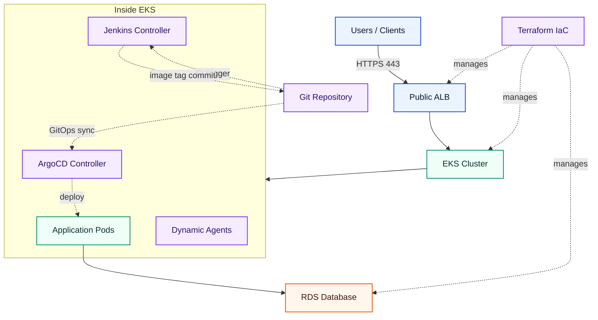

Author: Arunasalam Govindasamy

# Terraform Labs — Architecture Command Center

> Welcome to a production-grade reference architecture for AWS infrastructure, Spring Boot microservices, Kubernetes orchestration, and dynamic CI/CD delivery. This repository demonstrates **enterprise patterns** using **Infrastructure-as-Code**, **containerization**, and **GitOps principles**.

---

## 🎯 Quick Navigation

Explore four core domains of this architecture. **Click any box below to dive into detailed documentation:**

<table>
  <tr>
    <td align="center" width="20%">
      <h3>🏗️ Infrastructure</h3>
      <p>AWS VPC, EKS Cluster, RDS Database</p>
      <p><strong><a href="terraform/README.md">→ View Full Guide</a></strong></p>
      <p style="font-size: 0.9em;">Multi-tier networking, security groups, state management</p>
    </td>
    <td align="center" width="20%">
      <h3>📱 Application</h3>
      <p>Spring Boot Microservices, Events, APIs</p>
      <p><strong><a href="applications/README.md">→ View Full Guide</a></strong></p>
      <p style="font-size: 0.9em;">Service boundaries, sequence diagrams, learning path</p>
    </td>
    <td align="center" width="20%">
      <h3>⚙️ Kubernetes</h3>
      <p>EKS Runtime, Helm Charts, Ingress</p>
      <p><strong><a href="k8s/README.md">→ View Full Guide</a></strong></p>
      <p style="font-size: 0.9em;">Deployment model, Helm architecture, traffic routing</p>
    </td>
    <td align="center" width="20%">
      <h3>🚀 Delivery</h3>
      <p>Jenkins CI, ArgoCD GitOps, Pipelines</p>
      <p><strong><a href="cicd/README.md">→ View Full Guide</a></strong></p>
      <p style="font-size: 0.9em;">CI/CD separation, dynamic agents, GitOps deployments</p>
    </td>
    <td align="center" width="20%">
      <h3>📡 Observability</h3>
      <p>Metrics, Traces, Logs, Alerting</p>
      <p><strong><a href="observability/README.md">→ View Full Guide</a></strong></p>
      <p style="font-size: 0.9em;">Golden signals, dashboards, local verification, runbooks</p>
    </td>
  </tr>
</table>

---

## 💡 Why This Architecture?



**Four architectural tiers:**

1. **Infrastructure Reliability** — Terraform manages multi-AZ networking, auto-scaling compute, and isolated databases
2. **Application Excellence** — Spring Boot service with layered architecture, security-first design, and testability
3. **Runtime Orchestration** — Kubernetes on EKS with separate Helm charts for cleaner ownership and scaling
4. **Delivery Automation** — Jenkins CI for build/test/push, ArgoCD for GitOps deployments — each tool does one job

---

## 📚 What's Inside

| Folder | Purpose | Documentation |
|--------|---------|-----------------|
| `terraform/` | Infrastructure-as-Code for AWS | [Full Terraform Guide](terraform/README.md) |
| `applications/` | Spring Boot microservices architecture and service design | [Full Application Guide](applications/README.md) |
| `k8s/` | EKS Helm charts and deployment scripts | [Full Kubernetes Guide](k8s/README.md) |
| `cicd/` | Jenkins CI pipelines + ArgoCD GitOps manifests | [Full Delivery Guide](cicd/README.md) |
| `observability/` | Metrics, tracing, logging, dashboards, and alerting playbook | [Full Observability Guide](observability/README.md) |

---

## 🚀 Getting Started

### Prerequisites
- AWS Account with sufficient permissions
- Terraform >= 1.9
- Helm >= 3.0
- kubectl configured
- Docker (for local builds)

### Quick Deploy

```bash
# 1. Provision infrastructure
cd terraform/bootstrap
terraform init && terraform apply

cd ../
terraform init && terraform apply

# 2. Deploy Jenkins, ArgoCD, and the ALB controller
cd ../k8s
./scripts/deploy-all.sh

# 3. Register active applications with ArgoCD (GitOps takes over from here)
kubectl apply -f ../cicd/argocd/root-app-of-apps.yaml

# 4. Verify
kubectl get all -n document-processor
kubectl get all -n jenkins
kubectl get app document-processor -n argocd
```

---

## 🏛️ Repository Structure

```
.
├── README.md                          # This file — architecture portal
├── terraform/                         # Infrastructure Code
│   ├── README.md                     # Complete networking + security design
│   ├── bootstrap/                    # State bucket initialization
│   ├── modules/                      # VPC, EKS, RDS modules
│   └── versions.tf, variables.tf, ...
├── applications/                      # Business Services
│   ├── README.md                     # Application architecture + APIs
│   └── document-api-service/         # Spring Boot service
│       ├── src/main/java/...        # Source code
│       ├── pom.xml                   # Maven dependencies
│       └── src/test/java/...        # 41 unit tests
├── k8s/                              # Kubernetes Runtime
│   ├── README.md                     # Helm deployment model
│   ├── eks/                          # Application charts
│   │   ├── document-api-service/
│   │   └── document-processor/
│   ├── jenkins/                      # Dynamic Jenkins controller chart
│   │   └── dynamic-jenkins/
│   ├── argocd/                       # ArgoCD installation chart
│   │   └── argocd/
│   └── scripts/                      # Deployment automation
└── cicd/                              # CI/CD Pipelines & GitOps
    ├── README.md                      # Full CI/CD platform guide
    ├── jenkins/
    │   └── document-processor-ci.Jenkinsfile  # CI pipeline (build, test, push, tag commit)
    └── argocd/
      ├── root-app-of-apps.yaml               # Root GitOps entrypoint
      └── eks-services-applicationset.yaml    # Generates EKS service Applications
```

---

## 🎓 Learning Path

**For Infrastructure Engineers:**
→ Start with [terraform/README.md](terraform/README.md)
- Network topology, security groups, multi-AZ design
- EKS self-managed nodes, IAM IRSA patterns
- Remote Terraform state with locking

**For Application Developers:**
→ Start with [applications/README.md](applications/README.md)
- Service domain model and API contracts
- Authentication, authorization, validation
- Testing strategy with 41 unit tests per service

**For Platform/DevOps Engineers:**
→ Start with [k8s/README.md](k8s/README.md)
- Kubernetes cluster topology
- Helm chart separation patterns (app vs. ingress)
- Multi-environment deployment

**For CI/CD Specialists:**
→ Start with [cicd/README.md](cicd/README.md)
- Jenkins CI: build, test, push image, GitOps write-back
- ArgoCD: automated GitOps deployments from Git
- Dynamic agent pod provisioning and IRSA

---

## 📊 Key Metrics

| Aspect | Value | Notes |
|--------|-------|-------|
| **Network Layers** | 3 (public, private-app, private-db) | Segmented by tier and security boundary |
| **Availability Zones** | 3 (eu-west-1a/b/c) | Multi-AZ redundancy |
| **EKS Node Groups** | 3 (api, worker, batch) | Workload-specific labeling |
| **App Replicas** | 2 | Kubernetes deployment |
| **Unit Tests** | 41 | Comprehensive service coverage |
| **Helm Charts** | 4 | App, ALB, Jenkins, ArgoCD |

---

## 🔐 Security First

- **Network segmentation** — Public ALB → private compute → isolated database
- **Security Groups** — SG-to-SG rules (no open CIDR)
- **JWT authentication** — Stateless token-based auth
- **IAM IRSA** — Pod identity with fine-grained AWS permissions
- **Encrypted state** — Terraform state in S3 with DynamoDB locking
- **No secrets in code** — Environment variables and AWS Secrets Manager

---

## 💰 Cost Optimization

Free tier friendly with optional cost reductions:

- EKS control plane: **$0.10/hr** (not free tier)
- EC2 nodes: t3.micro × 3 (750 hrs/month included in free tier)
- RDS: db.t3.micro, 20 GiB (covered by free tier)
- NAT Gateway: **$0.045/hr** (optional: use `single_nat_gateway = true` for dev)

---

## 📖 Next Steps

1. **Understand the architecture** — Read the 4 detailed guides (one per box above)
2. **Provision infrastructure** — Follow the Terraform deployment guide
3. **Deploy the application** — Use the Kubernetes scripts
4. **Run CI** — Trigger one of the active Jenkins service pipelines (for example `document-processor-build`)
5. **Watch CD** — ArgoCD detects the tag commit and deploys automatically
6. **Extend and own** — Modify for your use case

---

## 🤝 Contributing & Support

This is a reference architecture. Feel free to adapt for your needs:
- Add additional services in `applications/`
- Extend Helm charts for multi-environment (dev/stage/prod)
- Integrate with your existing CI/CD system
- Scale infrastructure using Terraform variables

---

## 📝 License

Architecture and patterns by Arunasalam Govindasamy, 2026.
Use freely for learning and reference implementations.
