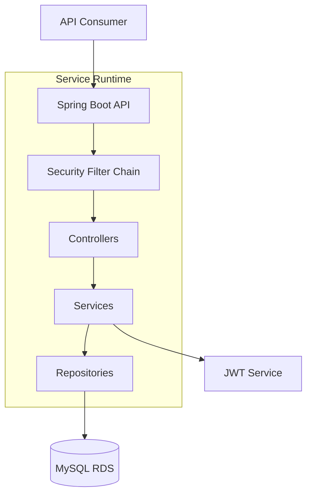
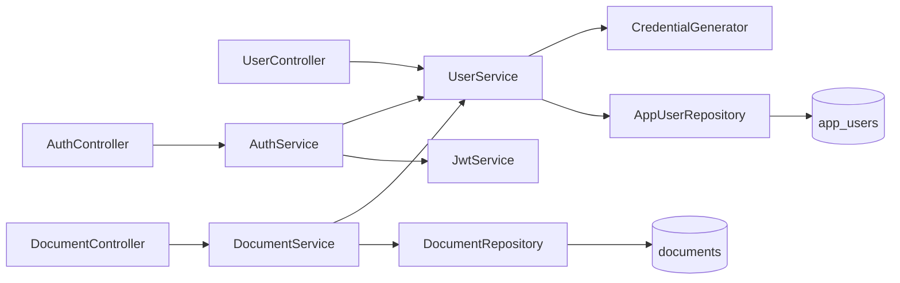
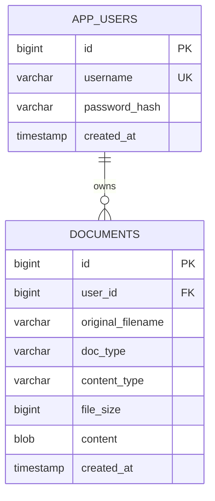
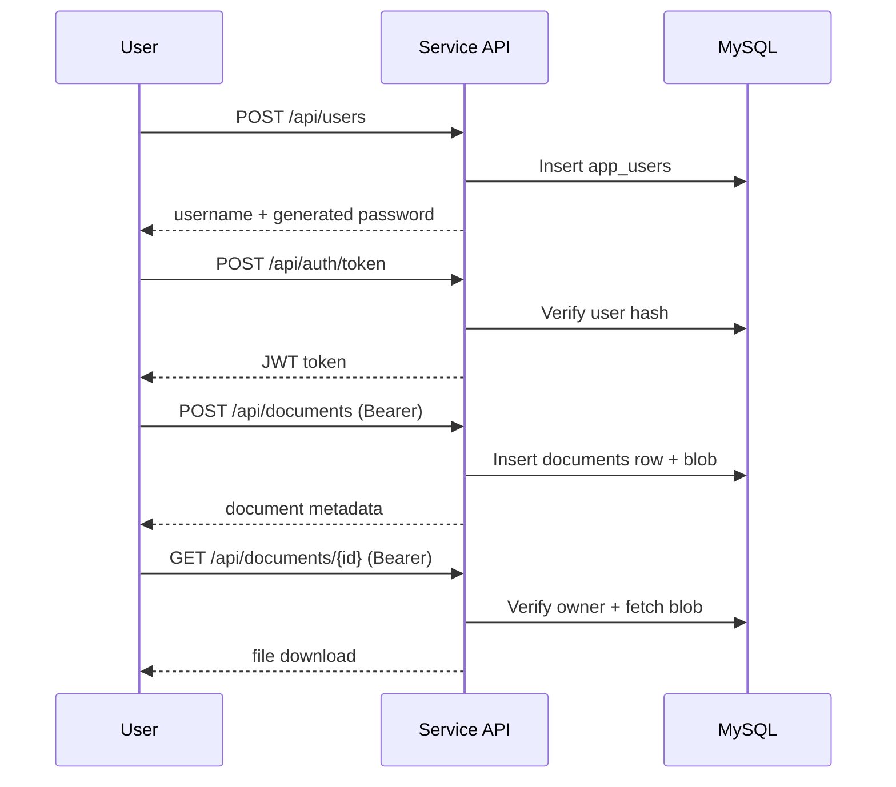

# Application Design — Document Management Platform

This folder contains the business application layer for Terraform Labs.

Current services:

- [applications/document-management-service](applications/document-management-service)
- [applications/document-processor](applications/document-processor)
- [applications/invoice-upload-service](applications/invoice-upload-service)

---

## 1. Executive View

The application is a stateless Spring Boot API that does four high-value tasks:

1. Provisions user credentials.
2. Issues JWT access tokens.
3. Accepts document uploads with size/type governance.
4. Serves user-owned document downloads.

This service is designed to run behind ALB on EKS while persisting data in MySQL RDS.

---

## 2. Architecture Overview

---

## 3. Layered Design

---

## 4. Security Model

The API uses JWT-based stateless authentication.

- Public endpoints:
	- `POST /api/users`
	- `POST /api/auth/token`
	- `GET /actuator/health`
- All other endpoints require Bearer token.

Security path:

1. `JwtAuthenticationFilter` checks `Authorization` header.
2. Token is validated using `JwtService`.
3. Username from token becomes authenticated principal.
4. Service layer uses principal identity for ownership checks.

---

## 5. Domain Model

Design notes:

- Usernames are generated uniquely.
- Passwords are stored as hashes, never plaintext.
- Document content is stored as BLOB in MySQL.
- Access control is owner-scoped during document download.

---

## 6. API Journey

---

## 7. Runtime Configuration

Primary runtime settings are in:

- `applications/document-management-service/src/main/resources/application.yml`

Important controls:

- DB endpoint/user/password via env vars.
- JWT secret and expiration.
- Upload limits (size + allowed types).

---

## 8. Quality and Extensibility

What is already in place:

- Clear layer boundaries (controller/service/repository).
- Consistent exception mapping (`GlobalExceptionHandler`).
- Unit-testable service classes.

How this can grow cleanly:

1. Add domain modules (for example `audit`, `retention`, `search`).
2. Externalize file storage from BLOB to S3 while preserving metadata in RDS.
3. Add role-based authorization for admin/reporting endpoints.
4. Introduce async workflows for heavy document processing.

---

## 9. Where to Go Next

- Infra and networking: [terraform/README.md](../terraform/README.md)
- Kubernetes runtime and Helm model: [k8s/README.md](../k8s/README.md)
- CI/CD and dynamic Jenkins agents: [jenkins/README.md](../jenkins/README.md)
