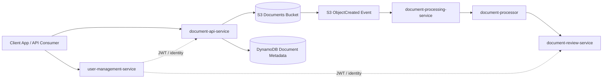
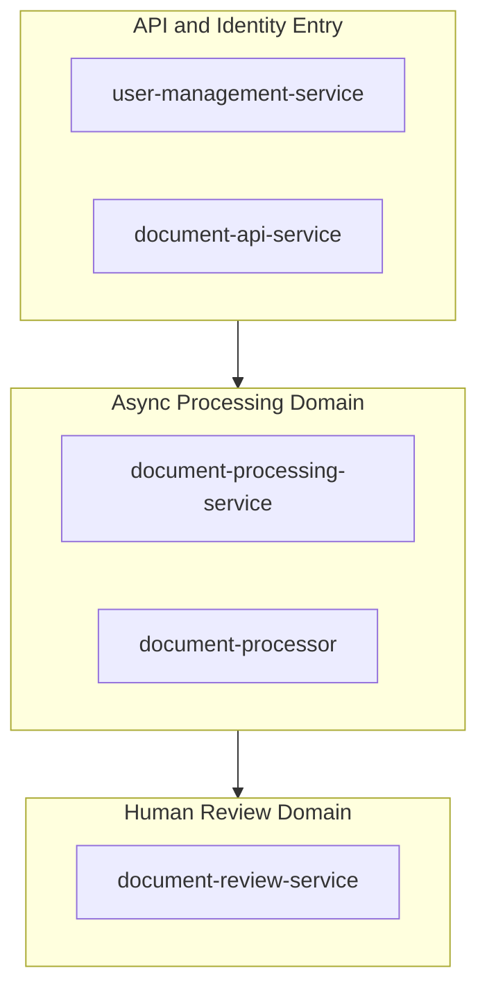
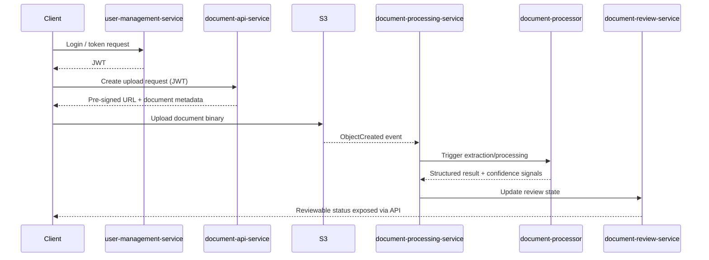
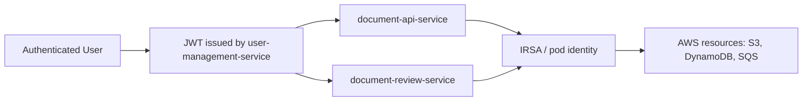

# Application Architecture — Document Platform Microservices

This folder contains the core business services for the document platform. The architecture is intentionally service-oriented: each service owns a focused responsibility, while integration between services happens through APIs and events.

---

## 1) Why this application architecture exists

The application layer is built for three goals:

1. Clear domain boundaries so each service can evolve independently.
2. Operational resilience through asynchronous processing and workflow handoffs.
3. Learning clarity: each service demonstrates a concrete architecture pattern.

---

## 2) Service catalog

| Service | Primary Responsibility | Trigger Type | Main Data Surface | Typical Consumers |
|---|---|---|---|---|
| document-api-service | Intake APIs, metadata creation, upload/view URL generation | Synchronous REST | DynamoDB metadata + S3 object paths | External clients, frontends |
| document-processing-service | Event orchestration for uploaded documents | Event-driven (S3/SQS) | DynamoDB processing state | S3 event flow, workflow pipeline |
| document-processor | Extraction and enrichment worker | Event-driven / internal processing | Processed payloads and derived fields | Downstream review and audit flows |
| document-review-service | Review workflow and status transitions | Synchronous REST + workflow updates | DynamoDB workflow state | Human review interfaces, workflow tools |
| user-management-service | Identity, authentication, token lifecycle | Synchronous REST | User/auth data + JWT claims | All service clients and API gateways |

---

## 3) System context

Key interpretation:

- Request path starts at API and identity services.
- Processing path starts from storage events, not user polling.
- Review path remains a separate bounded context.

---

## 4) Architectural style and boundaries

Boundary rules:

1. Identity concerns stay in user-management-service.
2. Upload/intake concerns stay in document-api-service.
3. Heavy processing is event-driven and isolated from request latency.
4. Human workflow states are isolated in document-review-service.

---

## 5) End-to-end document journey

---

## 6) Data ownership model

| Data Type | Owning Service | Why ownership is there |
|---|---|---|
| User credentials and auth claims | user-management-service | Centralized security and token issuance |
| Document intake metadata | document-api-service | API is the source of intake truth |
| Processing attempts and pipeline state | document-processing-service | Orchestrator tracks retries and transitions |
| Extracted/derived processing payloads | document-processor | Worker owns extraction logic and outputs |
| Review decisions and workflow status | document-review-service | Human-in-the-loop state belongs to review domain |

---

## 7) Security architecture

Security principles:

1. Authentication is centralized.
2. Authorization is enforced at service boundaries.
3. Cloud resource access is role-based through pod identity.
4. Secrets are externalized and never hardcoded.

---

## 8) Build and quality workflow

| Service | Standard command | Expected outcome |
|---|---|---|
| document-api-service | mvn clean verify | compile + tests + package |
| document-processing-service | mvn clean verify | compile + tests + package |
| document-processor | mvn clean verify | compile + tests + package |
| document-review-service | mvn clean verify | compile + tests + package |
| user-management-service | mvn clean verify | compile + tests + package |

Artifact hygiene:

- Maven outputs under target are ignored by git.
- Compiled class files are not tracked.
- CI should fail fast on compilation or test regressions.

---

## 9) Learning path for readers

If you are new to this codebase, follow this order:

1. Read document-api-service first to understand intake boundaries and metadata flow.
2. Read user-management-service next to understand authentication and trust model.
3. Read document-processing-service to understand orchestration and event handling.
4. Read document-processor for worker/extraction behavior.
5. Read document-review-service for workflow and final-state governance.

Recommended practical exercise:

1. Build each service locally with mvn clean verify.
2. Trace one document from upload request to review state.
3. Map each state transition to the owning service.

---

## 10) Relationship to other platform guides

- Infrastructure and cloud provisioning: ../terraform/README.md
- Kubernetes runtime and deployment model: ../k8s/README.md
- CI/CD and GitOps delivery: ../cicd/README.md

This document is intentionally application-focused. Read the other guides to connect architecture decisions across infra, runtime, and delivery.
