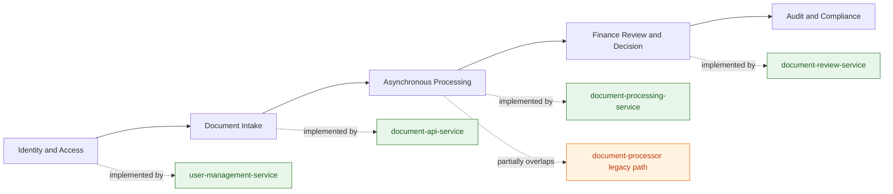
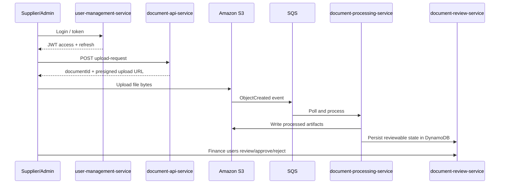
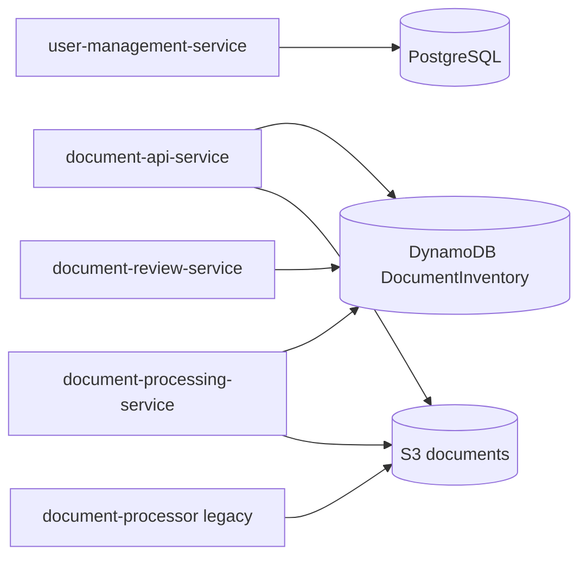
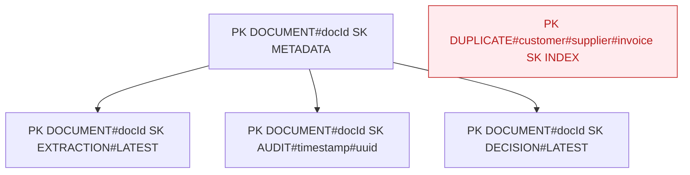
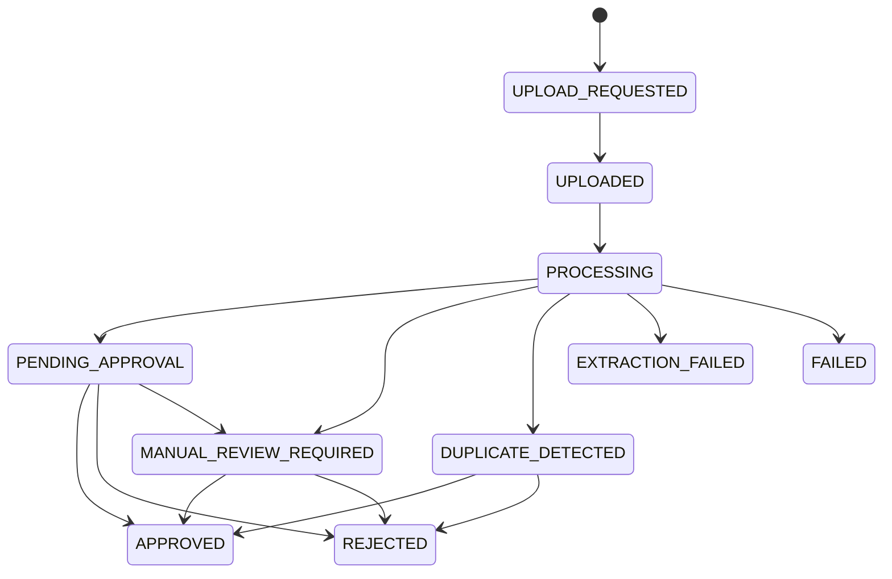

# Applications: Business Document Workflow Platform

## What Business Problem This Solves
Organizations with high invoice and receipt volumes need to move from manual email/spreadsheet handling to an auditable, secure, and scalable workflow.

This application layer enables:
1. Secure supplier/admin document intake.
2. Automatic extraction and validation pipeline.
3. Human finance review and decisioning.
4. Full traceability of status transitions and decisions.
5. Separation of identity, intake, processing, and review responsibilities.

## Business Capability Map

## End-to-End Runtime Flow

## Microservices And Detailed Docs

| Service | Status | Primary role | Detailed documentation |
|---|---|---|---|
| user-management-service | Implemented | Authentication, authorization roles, token lifecycle | [user-management-service/README.md](user-management-service/README.md) |
| document-api-service | Implemented | Upload request APIs, metadata persistence, presigned URLs | [document-api-service/README.md](document-api-service/README.md) |
| document-processing-service | Implemented (MVP) | SQS-driven orchestration, extraction persistence, status transitions | [document-processing-service/README.md](document-processing-service/README.md) |
| document-review-service | Implemented | Review queue, corrections, approve/reject, audit APIs | [document-review-service/README.md](document-review-service/README.md) |
| document-processor | In progress / legacy | Standalone multipart upload service to S3 | [document-processor/README.md](document-processor/README.md) |

## Data Architecture

Storage strategy:
1. PostgreSQL stores identity and refresh token records.
2. DynamoDB single-table design stores document workflow entities.
3. S3 stores binary uploads and processed artifact files.

## DocumentInventory Single-Table View

Access patterns used by implemented code:
1. GSI1 lookup by `S3KEY#{objectKey}` for processing correlation.
2. GSI2 lookup by `CUSTOMER#{customerId}#STATUS#{status}` for review queues.

## Lifecycle States Used In Implementation

## API Ownership Summary

| Domain | Owner service | API base path |
|---|---|---|
| Identity/Auth | user-management-service | `/api/v1/auth`, `/api/v1/users` |
| Intake | document-api-service | `/api/v1/documents` |
| Internal processing trigger | document-processing-service | `/api/internal/processing` |
| Review and decisions | document-review-service | `/api/review`, `/api/audit` |
| Legacy upload | document-processor | `/api/invoices` |

## Local Development

Run in each module directory:
1. `mvn clean verify`
2. `docker compose up --build` where compose file exists

Default service ports:
1. 8081 user-management-service
2. 8082 document-api-service
3. 8083 document-processing-service
4. 8084 document-review-service
5. 8080 document-processor

## Read Order For Engineering Or Interview Review

1. Read [user-management-service/README.md](user-management-service/README.md) for auth and role model.
2. Read [document-api-service/README.md](document-api-service/README.md) for intake API contracts and metadata schema.
3. Read [document-processing-service/README.md](document-processing-service/README.md) for orchestration/idempotency and DynamoDB write patterns.
4. Read [document-review-service/README.md](document-review-service/README.md) for correction and decision workflows.
5. Read [document-processor/README.md](document-processor/README.md) for the legacy standalone upload path.
