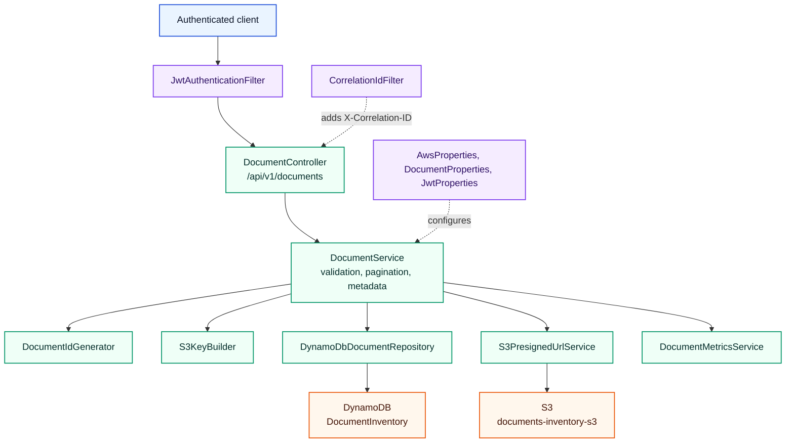
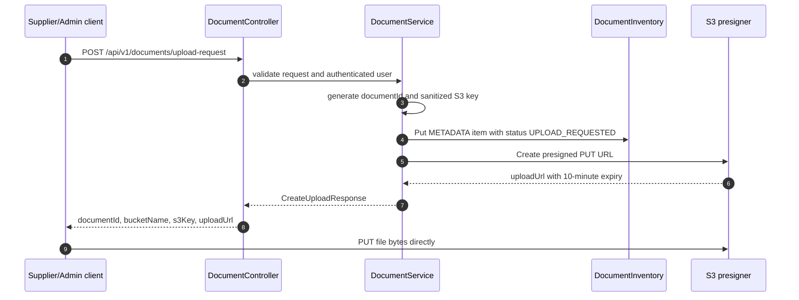

# document-api-service

Status: Implemented

## Role in the platform

`document-api-service` is the authenticated intake and document metadata API. It creates the durable DynamoDB metadata record before upload, returns short-lived S3 presigned URLs, lists document records, and exposes view URLs after upload. In the platform workflow it sits after identity and before asynchronous processing; see [../README.md](../README.md) for the cross-service view.

## Internal architecture

Package: `com.documentplatform.documentapi`.

*The API layer validates JWTs and request constraints before it writes DynamoDB metadata and delegates object transfer to S3 presigned URLs.*

Core implementation classes include `DocumentController`, `DocumentService`, `DynamoDbDocumentRepository`, `S3PresignedUrlService`, `S3KeyBuilder`, `FileNameSanitizer`, `JwtAuthenticationFilter`, and `SecurityConfig`.

## API contract

Base path: `/api/v1/documents`.

| Method | Path | Auth / role required | Request -> response |
|---|---|---|---|
| `POST` | `/api/v1/documents/upload-request` | JWT with `SUPPLIER` or `ADMIN` | `CreateUploadRequest` -> `CreateUploadResponse` with document ID, S3 key, presigned upload URL, status, and expiry. |
| `GET` | `/api/v1/documents` | JWT with `ADMIN`, `FINANCE_REVIEWER`, `FINANCE_APPROVER`, `SUPPLIER`, or `AUDITOR` | Query `customerId`, `status`, `documentType`, `page`, `size` -> `PagedDocumentResponse`. |
| `GET` | `/api/v1/documents/{documentId}` | Same roles as list | Path `documentId` -> `DocumentResponse`. |
| `GET` | `/api/v1/documents/{documentId}/view-url` | Same roles as list | Path `documentId` -> `ViewUrlResponse` with short-lived S3 URL. |

## Data model

| Model | Storage | Notes |
|---|---|---|
| `DocumentItem` | DynamoDB table `DocumentInventory` | Primary item `PK=DOCUMENT#{documentId}`, `SK=METADATA`; stores customer, document type, file metadata, bucket/key, status, uploader, processing attempts, revision, and timestamps. |
| `DocumentStatus` | Enum | `UPLOAD_REQUESTED`, `UPLOADED`, `PROCESSING`, `EXTRACTION_COMPLETED`, `PENDING_APPROVAL`, `MANUAL_REVIEW_REQUIRED`, `DUPLICATE_DETECTED`, `APPROVED`, `REJECTED`, `EXTRACTION_FAILED`, `FAILED`. |
| `DocumentType` | Enum | `INVOICE`, `RECEIPT`. |
| `GSI1` | DynamoDB customer index | Configured as `DYNAMODB_CUSTOMER_INDEX_NAME`. |
| `GSI2` | DynamoDB review index | Configured as `DYNAMODB_REVIEW_INDEX_NAME`. |

*The signature flow separates metadata ownership from byte transfer: the API owns the record, while S3 receives the file directly from the client.*

## Security

`SecurityConfig` requires authentication for `/api/v1/documents/**`, permits selected actuator/OpenAPI endpoints, uses a custom `JwtAuthenticationFilter`, and enables method-level role checks on controller methods. JWT configuration uses issuer `document-platform` by default and an HMAC secret from `JWT_SECRET`.

The Helm chart binds the pod to a ServiceAccount with an `eks.amazonaws.com/role-arn` annotation so AWS access should come from IRSA in EKS.

## Configuration

| Property / env var | Default or source | Purpose |
|---|---|---|
| `SERVER_PORT` | `8082` | HTTP port. |
| `AWS_REGION` | `eu-central-1` | AWS SDK region. |
| `AWS_ENDPOINT_OVERRIDE` | empty | LocalStack or alternate AWS endpoint. |
| `DYNAMODB_DOCUMENT_TABLE_NAME` | `DocumentInventory` | Document metadata table. |
| `DYNAMODB_CUSTOMER_INDEX_NAME` | `GSI1` | Customer query index. |
| `DYNAMODB_REVIEW_INDEX_NAME` | `GSI2` | Review/status query index. |
| `S3_BUCKET_NAME` | `documents-inventory-s3` | Document object bucket. |
| `S3_UPLOAD_URL_EXPIRY_MINUTES` | `10` | Presigned upload URL lifetime. |
| `S3_VIEW_URL_EXPIRY_MINUTES` | `5` | Presigned view URL lifetime. |
| `JWT_ISSUER` / `JWT_SECRET` | `document-platform` / `very-strong-secret-key-please-change` | JWT validation settings. |
| `document.max-file-size-bytes` | `20971520` | 20 MiB upload request limit. |
| `document.allowed-content-types` | PDF, PNG, JPEG, TIFF | MIME allowlist. |
| `OTEL_EXPORTER_OTLP_ENDPOINT` | `http://otel-collector.observability.svc.cluster.local:4318` | OTLP traces and metrics endpoint. |

## Testing

| Test class | Count | Coverage |
|---|---:|---|
| `DocumentApiIntegrationTest` | 6 | Upload request, listing, lookup, view URL, validation, and integration behavior with test containers. |
| `DocumentServiceValidationTest` | 1 | Service validation behavior. |
| `S3KeyBuilderTest` | 2 | S3 key construction and sanitization expectations. |
| `JwtTokenValidatorTest` | 2 | JWT validation behavior. |
| `FileNameSanitizerTest` | 2 | Filename cleanup and unsafe input handling. |

Total `@Test` methods: `13`.

## Run locally

| Command | Purpose |
|---|---|
| `mvn test` | Run unit and integration tests. |
| `mvn clean package -DskipTests` | Build the service jar. |
| `mvn spring-boot:run` | Run directly from the module. |
| `docker-compose up` | Start LocalStack on `4566` and the service on `8082`. |

Service URL: `http://localhost:8082`.