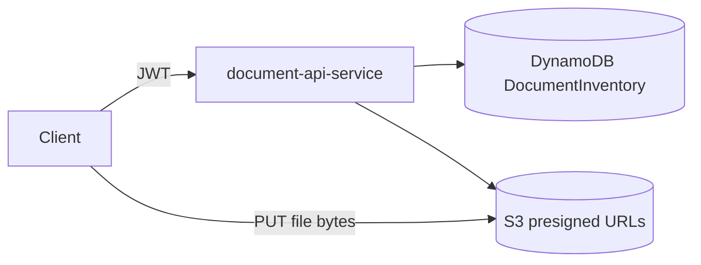
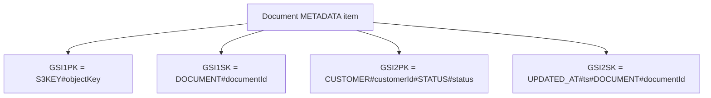

# document-api-service

Status: Implemented

## Business Responsibility
This service is the intake gateway for document submission.

It solves:
1. Creating durable metadata records before bytes are uploaded.
2. Issuing short-lived presigned URLs for direct S3 upload/view.
3. Enforcing type/size/content constraints early.

## Runtime Design



## API Specification

Base path: `/api/v1/documents`

| Endpoint | Auth + role | Request | Response |
|---|---|---|---|
| `POST /upload-request` | JWT, `SUPPLIER` or `ADMIN` | `customerId`, `documentType`, `fileName`, `contentType`, `fileSize` | `CreateUploadResponse` |
| `GET /` | JWT, finance/admin/supplier/auditor roles | query `customerId`, `status`, `documentType`, `page`, `size` | `PagedDocumentResponse` |
| `GET /{documentId}` | JWT, finance/admin/supplier/auditor roles | path `documentId` | `DocumentResponse` |
| `GET /{documentId}/view-url` | JWT, finance/admin/supplier/auditor roles | path `documentId` | `ViewUrlResponse` |

Validation rules from implementation:
1. `fileSize` must be positive and within configured max.
2. `documentType` currently accepted: `INVOICE`, `RECEIPT`.
3. `contentType` must be in configured allowlist.
4. `customerId` and filename are sanitized/normalized before persistence.

Examples (shape):

Request `POST /upload-request`:
```json
{
	"customerId": "customer-1001",
	"documentType": "INVOICE",
	"fileName": "invoice-123.pdf",
	"contentType": "application/pdf",
	"fileSize": 1048576
}
```

Response `CreateUploadResponse`:
```json
{
	"documentId": "doc_xxx",
	"bucketName": "documents-inventory-s3",
	"s3Key": "invoice/raw/customer-1001/doc_xxx/invoice-123.pdf",
	"uploadUrl": "https://...",
	"status": "UPLOAD_REQUESTED",
	"expiresInSeconds": 600
}
```

## Database Model (DynamoDB)

Table: `DocumentInventory`

Main item written by this service:
1. `PK=DOCUMENT#{documentId}`
2. `SK=METADATA`

Core attributes persisted:
1. identity: `documentId`, `customerId`, `uploadedBy`
2. file metadata: `fileName`, `contentType`, `fileSize`, `bucketName`, `s3Key`
3. lifecycle: `status`, `processingAttempts`, `documentRevision`, timestamps
4. index keys: `GSI1PK`, `GSI1SK`, `GSI2PK`, `GSI2SK`



Important access patterns in code:
1. `findByDocumentId` via primary key (`DOCUMENT#id`, `METADATA`).
2. `listByCustomerAndStatus` via review index (`GSI2`).

## Security Model

1. `/api/v1/documents/**` requires authenticated JWT.
2. Method-level role restrictions are enforced on controller methods.
3. Actuator and OpenAPI endpoints are public for local ops.

## Observability

Metrics used:
1. `documents_upload_requests_total`
2. `documents_upload_requests_failed_total`
3. `documents_view_url_generated_total`
4. `documents_upload_request_duration_seconds`

## Local Run

1. `docker compose up --build`
2. service URL: `http://localhost:8082`

## Build And Test

1. `mvn clean verify`

## Environment Variables (Important)

1. `DYNAMODB_DOCUMENT_TABLE_NAME`
2. `DYNAMODB_CUSTOMER_INDEX_NAME`
3. `DYNAMODB_REVIEW_INDEX_NAME`
4. `S3_BUCKET_NAME`
5. `S3_UPLOAD_URL_EXPIRY_MINUTES`
6. `S3_VIEW_URL_EXPIRY_MINUTES`
7. `JWT_ISSUER`
8. `JWT_SECRET`
9. `AWS_ENDPOINT_OVERRIDE`
