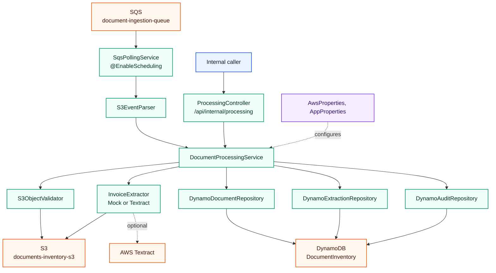
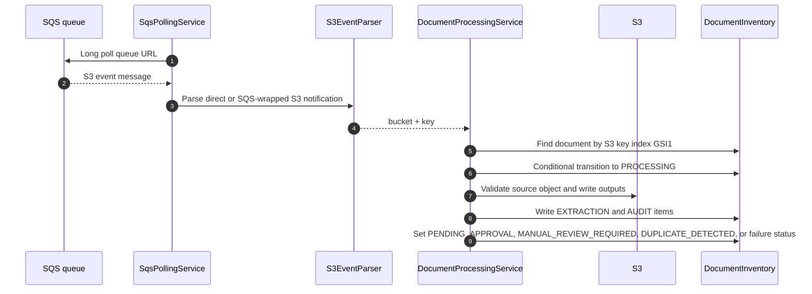
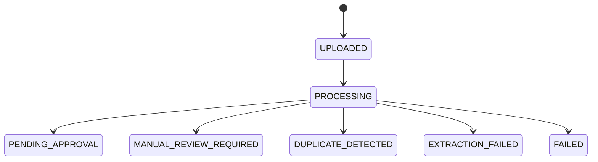

# document-processing-service

Status: Implemented

## Role in the platform

`document-processing-service` is the asynchronous processing worker between upload and finance review. It consumes document ingestion events, validates S3 objects, moves documents through processing statuses, extracts invoice data in `MOCK` or `TEXTRACT` mode, writes extraction and audit items, and leaves review-ready records in DynamoDB. In the wider workflow it starts after S3 upload and finishes before review; see [../README.md](../README.md) for the cross-service view.

## Internal architecture

Package: `com.documentplatform.documentprocessing`.

*The worker has two entry points: scheduled SQS polling for normal flow and an internal HTTP trigger for targeted processing.*

Core implementation classes include `SqsPollingService`, `S3EventParser`, `DocumentProcessingService`, `S3ObjectValidator`, `MockInvoiceExtractor`, `TextractInvoiceExtractor`, `DynamoDocumentRepository`, `DynamoExtractionRepository`, and `DynamoAuditRepository`.

## API contract

Base path: `/api/internal/processing`.

| Method | Path | Auth / role required | Request -> response |
|---|---|---|---|
| `POST` | `/api/internal/processing/process` | Internal; no Spring Security filter in this service | JSON map with `bucket` and `key` -> `{ "success": true/false }`. |
| `GET` | `/api/internal/processing/health` | Internal; no Spring Security filter in this service | none -> `{ "status": "UP" }`. |

## Data model

| Model | Storage | Notes |
|---|---|---|
| `DocumentItem` | DynamoDB table `DocumentInventory` | Metadata item keyed as `PK=DOCUMENT#{documentId}`, `SK=METADATA`; includes S3 location, status, attempts, processing timestamps, revision, and index keys. |
| `ExtractionItem` | Same DynamoDB table | Extraction output for the document, including structured invoice fields. |
| `AuditEventItem` | Same DynamoDB table | Status transition and processing audit trail. |
| `DocumentStatus` | Enum | Includes processing, review, approval, rejection, duplicate, extraction failure, and failed states. |
| `ExtractorMode` | Enum | `MOCK` or `TEXTRACT`. |

*The signature flow is queue-driven and guarded by conditional state transitions so duplicate or concurrent processors do not corrupt document state.*

*Processing owns the transition from uploaded object to review-ready or failure states.*

## Security

This service has no explicit Spring Security chain. Its HTTP API is internal by route convention, and the normal production path is SQS polling rather than public HTTP traffic. AWS access should be granted through the chart ServiceAccount IRSA annotation for DynamoDB, S3, SQS, and optional Textract calls.

## Configuration

| Property / env var | Default or source | Purpose |
|---|---|---|
| `SERVER_PORT` | `8083` | HTTP port. |
| `AWS_REGION` | `eu-central-1` | AWS SDK region. |
| `AWS_ENDPOINT_OVERRIDE` | empty | LocalStack or alternate AWS endpoint. |
| `S3_BUCKET_NAME` | `documents-inventory-s3` | Source and output bucket. |
| `DOCUMENT_INGESTION_QUEUE_URL` | `http://localhost:4566/000000000000/document-ingestion-queue` | SQS queue URL. |
| `DOCUMENT_INGESTION_SQS_WAIT_TIME_SECONDS` | `10` | Long-poll wait time. |
| `DOCUMENT_INGESTION_SQS_MAX_MESSAGES` | `5` | Max SQS messages per poll. |
| `DYNAMODB_DOCUMENT_TABLE_NAME` | `DocumentInventory` | Shared document table. |
| `DYNAMODB_S3_KEY_INDEX_NAME` | `GSI1` | S3-key lookup index. |
| `MAX_PROCESSING_ATTEMPTS` | `3` | Retry guard. |
| `PROCESSING_STALE_TIMEOUT_MINUTES` | `10` | Stale processing timeout. |
| `EXTRACTOR_MODE` | `MOCK` | Extractor implementation switch. |
| `MAX_FILE_SIZE_BYTES` | `20971520` | 20 MiB processing limit. |
| `OTEL_EXPORTER_OTLP_ENDPOINT` | `http://otel-collector.observability.svc.cluster.local:4318` | OTLP traces and metrics endpoint. |

## Testing

| Test class | Count | Coverage |
|---|---:|---|
| `DocumentProcessingServiceTest` | 8 | Processing outcomes, duplicate handling, failure paths, and repository interactions. |
| `S3ObjectValidatorTest` | 2 | S3 object validation rules. |
| `S3EventParserTest` | 1 | S3 event parsing. |

Total `@Test` methods: `11`.

## Run locally

| Command | Purpose |
|---|---|
| `mvn test` | Run the test suite. |
| `mvn clean package -DskipTests` | Build the service jar. |
| `mvn spring-boot:run` | Run directly from the module; requires LocalStack or AWS endpoint configuration. |
| `docker-compose up` | Start LocalStack on `4566` and the service on `8083`. |

Service URL: `http://localhost:8083`.