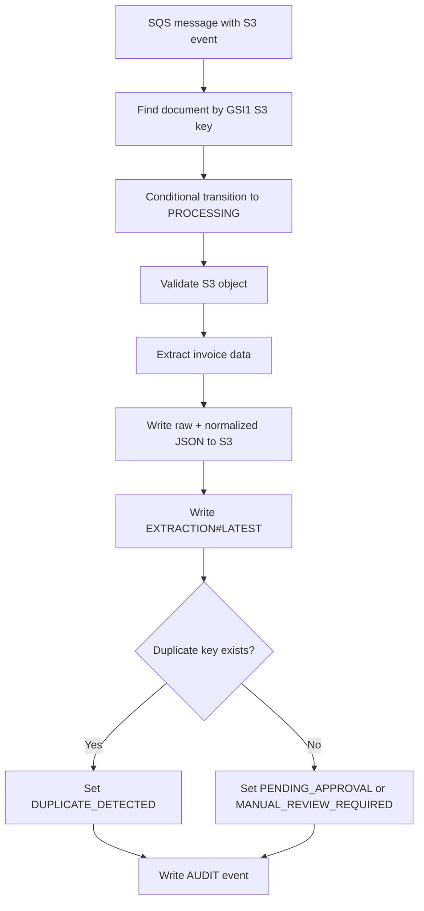
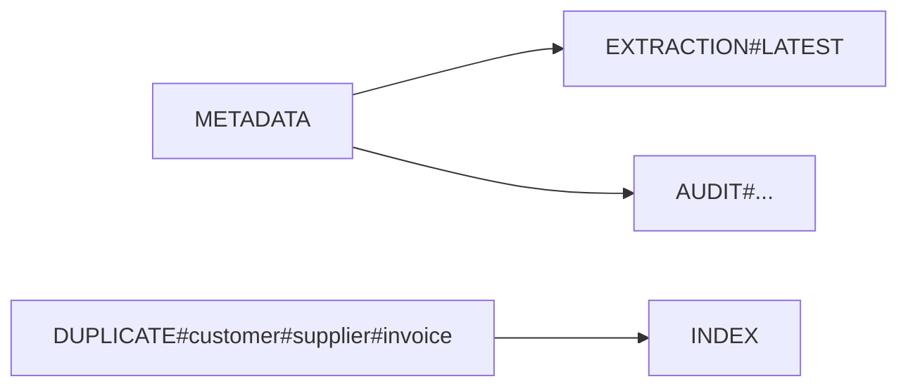

# document-processing-service

Status: Implemented (MVP)

## Business Responsibility
This service is the asynchronous workflow engine between upload and review.

It solves:
1. Converting upload events into structured extraction outputs.
2. Preventing duplicate or concurrent re-processing.
3. Producing review-ready status and audit records.

## Runtime Workflow



## API And Contracts

Base path: `/api/internal/processing`

| Endpoint | Purpose | Request | Response |
|---|---|---|---|
| `POST /process` | Trigger processing for a bucket/key pair | JSON map with `bucket`, `key` | `{ "success": true/false }` |
| `GET /health` | Internal health check | none | `{ "status": "UP" }` |

Example `POST /process` body:
```json
{
	"bucket": "documents-inventory-s3",
	"key": "invoice/raw/customer-1001/doc-123/file.pdf"
}
```

Background contract:
1. Polls SQS queue URL configured by `DOCUMENT_INGESTION_QUEUE_URL`.
2. Parses direct S3 notification and SQS-wrapped S3 notification formats.

## Extraction Modes

1. `MOCK`
2. `AWS_TEXTRACT`

Current implementation note:
1. `AWS_TEXTRACT` extractor path returns deterministic placeholder payloads in this snapshot.

## Database Model (DynamoDB)

Table: `DocumentInventory`

Item types written/updated by this service:
1. Document metadata item `PK=DOCUMENT#{documentId}`, `SK=METADATA`
2. Extraction item `PK=DOCUMENT#{documentId}`, `SK=EXTRACTION#LATEST`
3. Audit event item `PK=DOCUMENT#{documentId}`, `SK=AUDIT#{epochMillis}#{uuid}`
4. Duplicate index item `PK=DUPLICATE#{customerId}#{supplier}#{invoice}`, `SK=INDEX`



Idempotency and concurrency controls:
1. Conditional transition in `tryStartProcessing` prevents conflicting processors.
2. Processing attempt counters and stale timeout prevent infinite retries.
3. Duplicate key uses conditional put (`attribute_not_exists(PK)`).

## Status Transitions Produced

Primary terminal outcomes from this service:
1. `PENDING_APPROVAL`
2. `MANUAL_REVIEW_REQUIRED`
3. `DUPLICATE_DETECTED`
4. `EXTRACTION_FAILED`
5. `FAILED`

## S3 Output Layout

For each processed document:
1. `.../processed/{customerId}/{documentId}/textract-raw-output.json`
2. `.../processed/{customerId}/{documentId}/normalized-output.json`
3. failure payload at `.../failed/{customerId}/{documentId}/error.json` when exceptions occur

## Observability

Metrics:
1. `document_processing_success_total`
2. `document_processing_failed_total`
3. `document_processing_duplicate_detected_total`

Actuator:
1. `GET /actuator/health`
2. `GET /actuator/info`
3. `GET /actuator/prometheus`

## Local Run

1. `docker compose up --build`
2. service URL: `http://localhost:8083`

## Build And Test

1. `mvn clean verify`

## Environment Variables (Important)

1. `DOCUMENT_INGESTION_QUEUE_URL`
2. `DYNAMODB_DOCUMENT_TABLE_NAME`
3. `DYNAMODB_S3_KEY_INDEX_NAME`
4. `S3_BUCKET_NAME`
5. `MAX_PROCESSING_ATTEMPTS`
6. `PROCESSING_STALE_TIMEOUT_MINUTES`
7. `EXTRACTOR_MODE`
8. `AWS_ENDPOINT_OVERRIDE`
