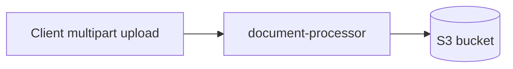

# document-processor

Status: In progress / legacy path

## Business Responsibility
This module provides a standalone multipart upload API for invoice files.

Current role in repository:
1. Validates file and customer inputs.
2. Stores uploaded file directly in S3.
3. Returns upload metadata.

It is not part of the current DynamoDB/SQS review pipeline used by the other services.

## API Specification

Base path: `/api/invoices`

| Endpoint | Purpose | Request | Response |
|---|---|---|---|
| `POST /upload` | Upload a file to S3 | multipart form-data with `customerId` and `file` | `UploadInvoiceResponse` |
| `GET /constraints` | Get server-side upload limits | none | `UploadConstraintsResponse` |

`customerId` validation:
1. regex `^[a-zA-Z0-9_-]{3,64}$`

`UploadInvoiceResponse` fields:
1. `bucketName`
2. `objectKey`
3. `customerId`
4. `fileType`
5. `contentType`
6. `sizeBytes`

## Storage Model

This module has no relational or DynamoDB schema.

Persistence behavior:
1. Writes only to S3 bucket configured by `DOCUMENTS_S3_BUCKET`.
2. Object key format: `{extension}/raw/{customerId}/{timestamp-uuid-filename}`.

## Validation Rules

1. File must be present and non-empty.
2. File size must be <= configured max.
3. Filename must be safe (path traversal blocked).
4. Extension must be in allowed list.
5. Content type must be in allowed list.

## Local Run

1. `mvn clean spring-boot:run`
2. default port: `8080`

## Build And Test

1. `mvn clean verify`

## Environment Variables (Important)

1. `DOCUMENTS_S3_BUCKET`
2. `MAX_UPLOAD_FILE_SIZE_BYTES`
3. `ALLOWED_EXTENSIONS`
4. `ALLOWED_CONTENT_TYPES`
5. `MULTIPART_MAX_FILE_SIZE`
6. `MULTIPART_MAX_REQUEST_SIZE`

## Scope Note

1. This module overlaps with intake concerns already handled by `document-api-service`.
2. Treat as transitional unless explicitly integrated into the primary workflow.
