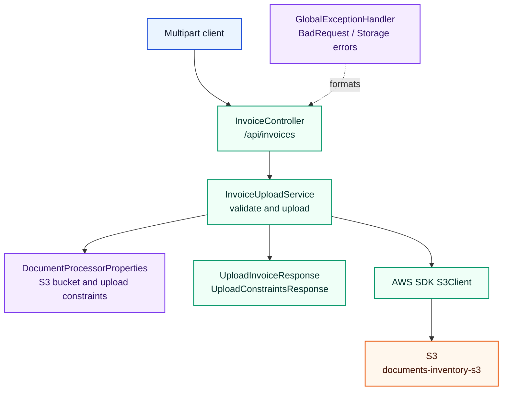
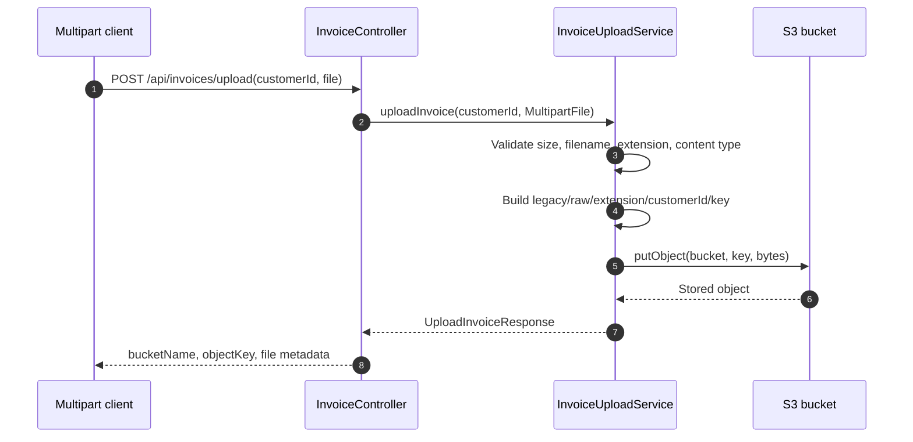

# document-processor

Status: In progress / legacy path

## Role in the platform

`document-processor` is a standalone multipart invoice upload service retained as a transitional path. It validates file and customer inputs, uploads accepted files directly to S3, and returns upload metadata. It does not participate in the current DynamoDB/SQS review pipeline used by the primary services; see [../README.md](../README.md) for the cross-service view.

## Internal architecture

Package: `com.terraformlabs.documentprocessor`.

*The service is intentionally small: controller validation and upload orchestration wrap a single S3 dependency.*

Core implementation classes include `InvoiceController`, `InvoiceUploadService`, `DocumentProcessorProperties`, `AwsConfig`, `GlobalExceptionHandler`, `BadRequestException`, and `StorageException`.

## API contract

Base path: `/api/invoices`.

| Method | Path | Auth / role required | Request -> response |
|---|---|---|---|
| `POST` | `/api/invoices/upload` | No authentication in this module | Multipart form-data with `customerId` and `file` -> `UploadInvoiceResponse`. |
| `GET` | `/api/invoices/constraints` | No authentication in this module | none -> `UploadConstraintsResponse`. |

`customerId` must match `^[a-zA-Z0-9_-]{3,64}$`.

## Data model

| Model | Storage | Notes |
|---|---|---|
| `UploadInvoiceResponse` | API response only | Returns bucket name, object key, customer ID, file type, content type, and size bytes. |
| `UploadConstraintsResponse` | API response only | Returns bucket name, max file size, allowed extensions, and allowed content types. |
| S3 object | S3 bucket `documents-inventory-s3` by default | Object key format is `legacy/raw/{extension}/{customerId}/{epochMillis}-{uuid}-{sanitizedFilename}`. This standalone path writes outside the `invoice/raw/` and `receipt/raw/` prefixes that trigger the async SQS pipeline. |

The module owns no relational schema and no DynamoDB item model.

*The signature flow accepts one multipart request, enforces local upload constraints, and writes the object directly to S3.*

## Security

There is no Spring Security configuration in this module. Input protection is implemented through request validation and service-level file checks: non-empty file, maximum size, safe filename, allowed extension, allowed content type, and the `customerId` regex. AWS access is through the configured `S3Client`; the EKS chart includes a ServiceAccount annotation placeholder for IRSA.

## Configuration

| Property / env var | Default or source | Purpose |
|---|---|---|
| `server.port` | `8080` | HTTP port. |
| `MULTIPART_MAX_FILE_SIZE` | `10MB` | Spring multipart file limit. |
| `MULTIPART_MAX_REQUEST_SIZE` | `10MB` | Spring multipart request limit. |
| `DOCUMENTS_S3_BUCKET` | `documents-inventory-s3` | Upload bucket. |
| `MAX_UPLOAD_FILE_SIZE_BYTES` | `10485760` | 10 MiB service-level upload limit. |
| `ALLOWED_EXTENSIONS` | `PDF,PNG,JPEG,JPG` | Extension allowlist. |
| `ALLOWED_CONTENT_TYPES` | `application/pdf,image/png,image/jpeg` | MIME allowlist. |

## Testing

| Test class | Count | Coverage |
|---|---:|---|
| `InvoiceUploadServiceTest` | 3 | Successful upload, unsupported extension rejection, and oversized file rejection using an S3Client mock. |

Total `@Test` methods: `3`.

## Run locally

| Command | Purpose |
|---|---|
| `mvn test` | Run the unit test suite. |
| `mvn clean package -DskipTests` | Build the service jar. |
| `mvn spring-boot:run` | Run directly on port `8080`; start AWS/S3-compatible dependencies separately if needed. |

Service URL: `http://localhost:8080`.