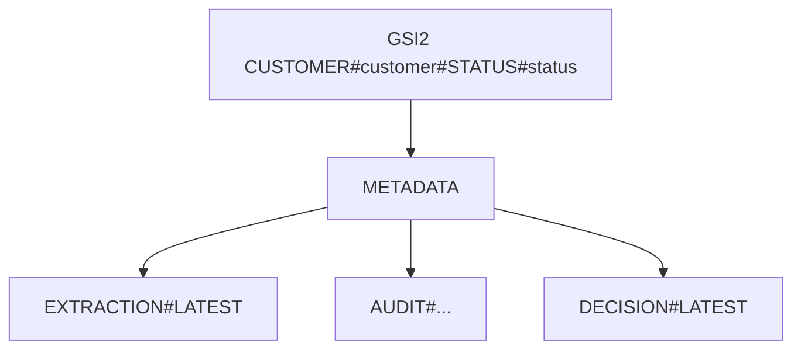

# document-review-service

Status: Implemented

## Business Responsibility
This service is the finance decision and audit API for processed documents.

It solves:
1. Queueing documents for finance review by customer/status.
2. Allowing controlled correction of extracted fields.
3. Capturing approve/reject decisions with traceability.
4. Exposing audit history for governance/compliance.

## API Specification

Base paths:
1. `/api/review`
2. `/api/audit`

### Review APIs

| Endpoint | Purpose | Request | Response |
|---|---|---|---|
| `GET /api/review/queue` | Fetch queue by customer/status | query: `customerId`, `status`, `limit`, `nextToken` | `ReviewQueueResponse` |
| `GET /api/review/{documentId}` | Get review details | path: `documentId` | `ReviewDetailsResponse` |
| `PATCH /api/review/{documentId}/fields` | Apply manual corrections | `expectedDocumentRevision`, `corrections`, `comment` | `FieldCorrectionResponse` |
| `POST /api/review/{documentId}/approve` | Approve document | `expectedDocumentRevision`, `comment`, `overrideDuplicate` | `ApproveDocumentResponse` |
| `POST /api/review/{documentId}/reject` | Reject document | `expectedDocumentRevision`, `reasonCode`, `comment` | `RejectDocumentResponse` |

### Audit APIs

| Endpoint | Purpose | Request | Response |
|---|---|---|---|
| `GET /api/audit/{documentId}` | Read audit trail | query: `limit` | `AuditHistoryResponse` |
| `GET /api/audit/{documentId}/decision` | Read latest decision | path: `documentId` | `ReviewDecisionResponse` |

## Transition And Revision Rules

Business rules enforced in code:
1. All correction/decision writes require `expectedDocumentRevision` for optimistic concurrency.
2. Invalid transitions are rejected by `DocumentStatusTransitionService`.
3. Duplicate documents require `overrideDuplicate=true` for approve flow.

Allowed transitions enforced:
1. `PENDING_APPROVAL` -> `APPROVED`, `REJECTED`, `MANUAL_REVIEW_REQUIRED`
2. `MANUAL_REVIEW_REQUIRED` -> `APPROVED`, `REJECTED`
3. `DUPLICATE_DETECTED` -> `APPROVED`, `REJECTED`
4. `EXTRACTION_COMPLETED` -> `PENDING_APPROVAL`, `MANUAL_REVIEW_REQUIRED`, `DUPLICATE_DETECTED`

## Security Model

JWT requirements:
1. issuer must match configured `JWT_ISSUER`
2. token signed with configured HMAC secret in this service

Role access:
1. `/api/review/**` -> `FINANCE_REVIEWER`, `FINANCE_APPROVER`, `ADMIN`
2. `/api/audit/**` -> `FINANCE_REVIEWER`, `FINANCE_APPROVER`, `ADMIN`
3. `/actuator/prometheus` -> `ADMIN`

## Database Model (DynamoDB)

Table: `DocumentInventory`

Item types used by this service:
1. `PK=DOCUMENT#{documentId}`, `SK=METADATA`
2. `PK=DOCUMENT#{documentId}`, `SK=EXTRACTION#LATEST`
3. `PK=DOCUMENT#{documentId}`, `SK=AUDIT#{timestamp}#{uuid}`
4. `PK=DOCUMENT#{documentId}`, `SK=DECISION#LATEST`

Queue read access pattern:
1. Query `GSI2` partition key `CUSTOMER#{customerId}#STATUS#{status}`.

## Local Run

1. `docker compose up --build`
2. service URL: `http://localhost:8084`

Helper scripts:
1. `./scripts/seed-review-document.sh doc-1001`
2. `./scripts/generate-jwt.sh`
3. `./scripts/demo-requests.sh`

## Build And Test

1. `mvn clean verify`

## Environment Variables (Important)

1. `DYNAMODB_DOCUMENT_TABLE_NAME`
2. `DYNAMODB_REVIEW_QUEUE_INDEX_NAME`
3. `S3_BUCKET_NAME`
4. `S3_VIEW_URL_EXPIRY_MINUTES`
5. `JWT_SECRET`
6. `JWT_ISSUER`
7. `AUDIT_READ_EVENTS_ENABLED`
8. `AWS_ENDPOINT_OVERRIDE`
