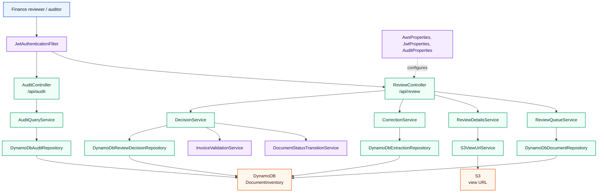
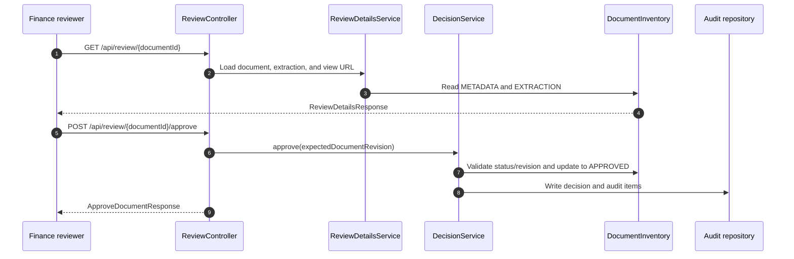
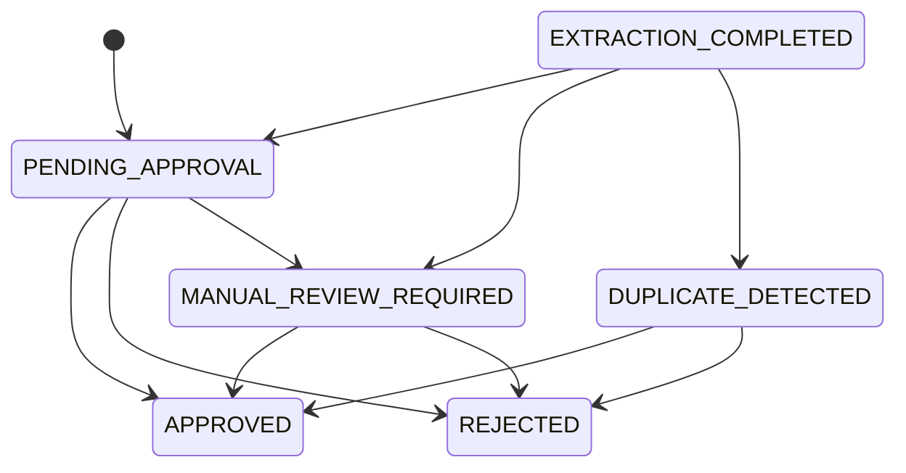

# document-review-service

Status: Implemented

## Role in the platform

`document-review-service` is the finance review, correction, decision, and audit API. It reads review-queue records from DynamoDB, exposes extracted document details, applies field corrections, approves or rejects documents, and returns audit/decision history. In the wider workflow it starts after processing has produced review-ready states; see [../README.md](../README.md) for the cross-service view.

## Internal architecture

Package: `com.documentplatform.documentreview`.

*The service separates queue/details/correction/decision/audit concerns while sharing DynamoDB repositories over the `DocumentInventory` table.*

Core implementation classes include `ReviewController`, `AuditController`, `ReviewQueueService`, `ReviewDetailsService`, `CorrectionService`, `DecisionService`, `AuditQueryService`, `DocumentStatusTransitionService`, `JwtAuthenticationFilter`, and `SecurityConfig`.

## API contract

| Method | Path | Auth / role required | Request -> response |
|---|---|---|---|
| `GET` | `/api/review/queue` | JWT with `FINANCE_REVIEWER`, `FINANCE_APPROVER`, or `ADMIN` | Query `customerId`, `status` default `PENDING_APPROVAL`, `limit` 1-100, `nextToken` -> `ReviewQueueResponse`. |
| `GET` | `/api/review/{documentId}` | Same review roles | Path `documentId` -> `ReviewDetailsResponse`. |
| `PATCH` | `/api/review/{documentId}/fields` | Same review roles | `FieldCorrectionRequest` -> `FieldCorrectionResponse`. |
| `POST` | `/api/review/{documentId}/approve` | Same review roles | `ApproveDocumentRequest` -> `ApproveDocumentResponse`. |
| `POST` | `/api/review/{documentId}/reject` | Same review roles | `RejectDocumentRequest` -> `RejectDocumentResponse`. |
| `GET` | `/api/audit/{documentId}` | Same review roles | Query `limit` default `50`, max `200` -> `AuditHistoryResponse`. |
| `GET` | `/api/audit/{documentId}/decision` | Same review roles | Path `documentId` -> `ReviewDecisionResponse`. |

## Data model

| Model | Storage | Notes |
|---|---|---|
| `DocumentItem` | DynamoDB table `DocumentInventory` | Metadata and review queue fields; `GSI2` is used for review queue access. |
| `ExtractionItem` | Same DynamoDB table | Extracted invoice fields shown and corrected during review. |
| `ReviewDecisionItem` | Same DynamoDB table | Latest approval/rejection decision and reviewer metadata. |
| `AuditEventItem` | Same DynamoDB table | Status changes and review/audit events. |
| `DocumentStatus` | Enum | Includes `PENDING_APPROVAL`, `MANUAL_REVIEW_REQUIRED`, `DUPLICATE_DETECTED`, `APPROVED`, `REJECTED`, and related processing states. |
| `ReviewDecisionType` / `RejectReasonCode` | Enums | Decision type and structured rejection reason. |

*The signature flow combines human review with optimistic revision checks before a decision and audit record are written.*

*Review owns the controlled transition from review states into final approve/reject outcomes.*

## Security

`SecurityConfig` disables CSRF, uses stateless sessions, permits health/info/OpenAPI endpoints, requires `ADMIN` for `/actuator/prometheus`, and restricts `/api/review/**` and `/api/audit/**` to `FINANCE_REVIEWER`, `FINANCE_APPROVER`, or `ADMIN`. `JwtAuthenticationFilter` validates JWTs using `JWT_ISSUER` and `JWT_SECRET`, while `CorrelationIdFilter` exposes correlation IDs.

AWS access should come from the chart ServiceAccount IRSA annotation for DynamoDB and S3 view URL permissions.

## Configuration

| Property / env var | Default or source | Purpose |
|---|---|---|
| `SERVER_PORT` | `8084` | HTTP port. |
| `AWS_REGION` | `eu-central-1` | AWS SDK region. |
| `AWS_ENDPOINT_OVERRIDE` | empty | LocalStack or alternate AWS endpoint. |
| `S3_BUCKET_NAME` | `documents-inventory-s3` | Source document bucket for view URLs. |
| `S3_VIEW_URL_EXPIRY_MINUTES` | `5` | Presigned view URL lifetime. |
| `DYNAMODB_DOCUMENT_TABLE_NAME` | `DocumentInventory` | Shared document table. |
| `DYNAMODB_REVIEW_QUEUE_INDEX_NAME` | `GSI2` | Review queue index. |
| `JWT_ISSUER` / `JWT_SECRET` | `document-platform` / `change-this-secret` | JWT validation settings. |
| `AUDIT_READ_EVENTS_ENABLED` | `false` | Read-event audit logging flag. |
| `CORS_ALLOWED_ORIGINS` | `http://localhost:3000` | CORS allowlist. |
| `OTEL_EXPORTER_OTLP_ENDPOINT` | `http://otel-collector.observability.svc.cluster.local:4318` | OTLP traces and metrics endpoint. |

## Testing

| Test class | Count | Coverage |
|---|---:|---|
| `InvoiceValidationServiceTest` | 2 | Invoice validation rules. |
| `JwtServiceTest` | 1 | JWT claim parsing. |
| `DocumentStatusTransitionServiceTest` | 2 | Valid and invalid status transitions. |
| `ReviewControllerSecurityTest` | 1 | Review endpoint authorization behavior. |

Total `@Test` methods: `6`.

## Run locally

| Command | Purpose |
|---|---|
| `mvn test` | Run unit and security integration tests. |
| `mvn clean package -DskipTests` | Build the service jar. |
| `mvn spring-boot:run` | Run directly from the module. |
| `docker-compose up` | Start LocalStack on `4566` and the service on `8084`. |

Service URL: `http://localhost:8084`.