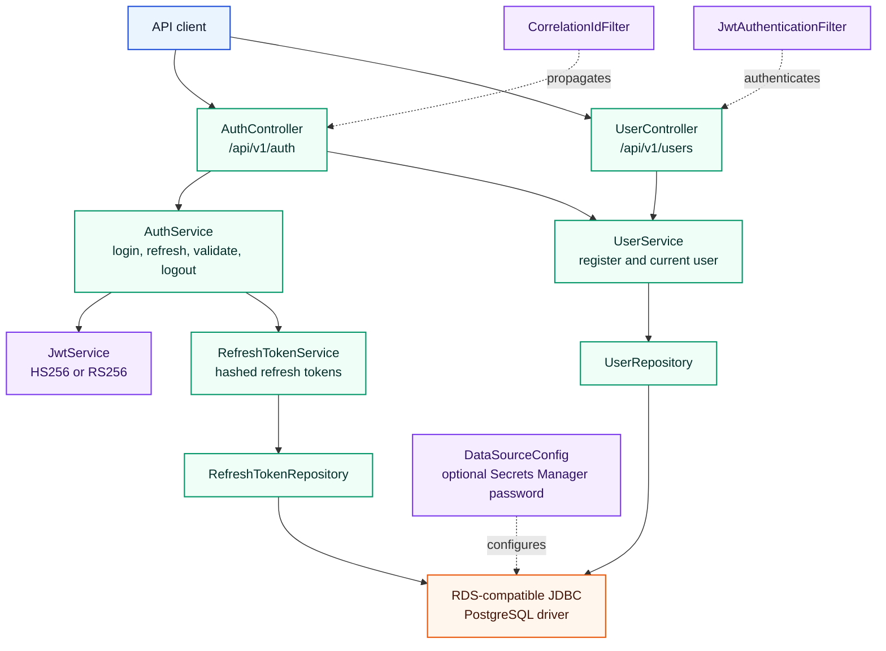
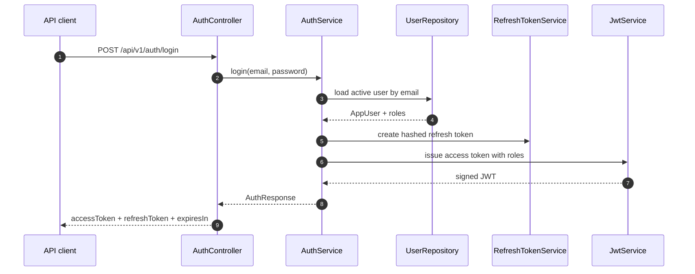

# user-management-service

Status: Implemented

## Role in the platform

`user-management-service` is the identity and token authority for the document platform. It owns user registration, login, refresh-token lifecycle, role claims, public key discovery, and ADMIN-only user administration. In the wider workflow it issues the JWTs consumed by the document APIs; see [../README.md](../README.md) for the cross-service view.

## Internal architecture

Package: `com.terraformlabs.ums`.

*The service is a conventional Spring layered component: controllers delegate to identity services, services persist through JPA repositories, and security filters protect everything outside the public auth surface.*

Security and configuration classes include `SecurityConfig`, `SecurityProperties`, `AwsSecretsProperties`, `DataSourceConfig`, `JwtAuthenticationFilter`, `JwtService`, and `CorrelationIdFilter`.

## API contract

| Method | Path | Auth / role required | Request -> response |
|---|---|---|---|
| `POST` | `/api/v1/auth/register` | Public | `RegisterUserRequest` -> `UserResponse` |
| `POST` | `/api/v1/auth/login` | Public | `LoginRequest` -> `AuthResponse` |
| `POST` | `/api/v1/auth/refresh` | Public | `RefreshTokenRequest` -> `RefreshAccessTokenResponse` |
| `POST` | `/api/v1/auth/logout` | Authenticated request; optional `X-Refresh-Token` | Revokes refresh-token context; empty response body |
| `POST` | `/api/v1/auth/validate` | Public | `TokenValidationRequest` -> `TokenValidationResponse` |
| `GET` | `/api/v1/auth/public-key` | Public | none -> `PublicKeyResponse` with algorithm and PEM when available |
| `POST` | `/api/v1/users` | `ADMIN` | `CreateUserRequest` -> `UserResponse` |
| `PUT` | `/api/v1/users/{userId}/roles` | `ADMIN` | `UpdateUserRolesRequest` -> `UserResponse` |
| `GET` | `/api/v1/users/me` | Authenticated | none -> `UserResponse` |

## Data model

| Model | Storage | Notes |
|---|---|---|
| `AppUser` | JPA table `users` | Email, full name, password hash, `UserStatus`, failed login counters, lock timestamp, timestamps. |
| `Role` | JPA element collection table `user_roles` | `ADMIN`, `FINANCE_REVIEWER`, `FINANCE_APPROVER`, `SUPPLIER`, `AUDITOR`. |
| `RefreshToken` | JPA table `refresh_tokens` | Stored hashed, expiration-aware, and revocable. |
| `UserStatus` | Enum | `ACTIVE`, `LOCKED`. |

The application is configured with `org.postgresql.Driver` and a default `jdbc:postgresql://.../document_identity` datasource. The Terraform RDS layer currently provisions MySQL, so this README records the application contract rather than hiding that infrastructure/application mismatch.

## Security

`SecurityConfig` disables CSRF for stateless API use, enables CORS, installs `CorrelationIdFilter` and `JwtAuthenticationFilter`, permits OpenAPI and selected actuator endpoints, and requires authentication for all other routes. Method-level authorization protects ADMIN-only user-management operations.

*The signature flow authenticates credentials once, stores only a hashed refresh token, and returns role-bearing JWTs for downstream services.*

## Configuration

| Property / env var | Default or source | Purpose |
|---|---|---|
| `SERVER_PORT` | `8081` | HTTP port. |
| `SPRING_DATASOURCE_URL` / `DB_HOST` / `DB_PORT` / `DB_NAME` | `jdbc:postgresql://localhost:5432/document_identity` | JDBC target. |
| `SPRING_DATASOURCE_USERNAME` / `DB_USERNAME` | `doc_user` | Database user. |
| `SPRING_DATASOURCE_PASSWORD` / `DB_PASSWORD` | `doc_password` | Database password fallback. |
| `AWS_DB_PASSWORD_SECRET_NAME` | empty | Optional Secrets Manager secret name for DB password. |
| `AWS_REGION` | `eu-west-1` | Secrets Manager region for DB secret lookup. |
| `JWT_ISSUER` | `document-platform` | JWT issuer claim. |
| `JWT_SECRET` | `very-strong-secret-key-please-change` | HS256 fallback secret. |
| `JWT_PRIVATE_KEY_PATH` / `JWT_PUBLIC_KEY_PATH` | `/etc/secrets/jwt/*.pem` | RSA key paths for RS256 mode. |
| `JWT_ACCESS_TOKEN_EXPIRY_MINUTES` | `15` | Access-token lifetime. |
| `JWT_REFRESH_TOKEN_EXPIRY_DAYS` | `7` | Refresh-token lifetime. |
| `PASSWORD_BCRYPT_STRENGTH` | `12` | Password hashing work factor. |
| `MAX_LOGIN_ATTEMPTS` / `ACCOUNT_LOCK_MINUTES` | `5` / `15` | Account lockout behavior. |
| `OTEL_EXPORTER_OTLP_ENDPOINT` | `http://otel-collector.observability.svc.cluster.local:4318` | OTLP traces and metrics endpoint. |

## Testing

| Test class | Count | Coverage |
|---|---:|---|
| `AuthFlowIntegrationTest` | 1 | Register, login, refresh, validate, and logout flow against the Spring context. |

Total `@Test` methods: `1`.

## Run locally

| Command | Purpose |
|---|---|
| `mvn test` | Run the test suite. |
| `mvn clean package -DskipTests` | Build the service jar. |
| `mvn spring-boot:run` | Run directly from the module. |
| `docker-compose up` | Start local Postgres on `5433` and the service on `8081`. |

Service URL: `http://localhost:8081`.