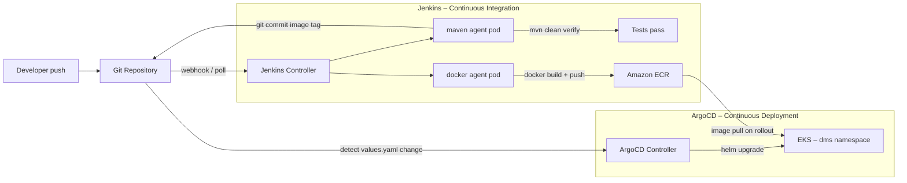

# CI/CD Platform — Jenkins + ArgoCD GitOps

This folder owns everything that drives automated delivery for the Terraform Labs platform.

The CI/CD model follows a strict **separation of concerns**:

- **Jenkins** (in `cicd/jenkins/`) is responsible for **Continuous Integration** — compile, test, build and push the container image, then write the new image tag back to Git.
- **ArgoCD** (in `cicd/argocd/`) is responsible for **Continuous Deployment** — watch the Git repository and synchronise the live cluster state with what is declared there.

Neither tool does the other's job.

---

## Folder Structure

```
cicd/
├── jenkins/
│   └── dms-ci.Jenkinsfile          # CI pipeline — build, test, push, git write-back
└── argocd/
    └── dms-application.yaml        # ArgoCD Application CRD — GitOps deployment
```

The Helm charts that **install** Jenkins and ArgoCD into the cluster live under `k8s/`:

```
k8s/
├── jenkins/
│   └── dynamic-jenkins/            # Wrapper chart for the Jenkins controller
└── argocd/
    └── argocd/                     # Wrapper chart for ArgoCD
```

---

## Architecture



**Flow step by step:**

1. A developer pushes code (or a PR is merged).
2. Jenkins checks out the repository, compiles and tests the application.
3. Jenkins builds the container image and pushes it to ECR with an immutable tag (`BUILD_NUMBER-shortSHA`).
4. Jenkins patches `image.tag` in `k8s/eks/document-management-service/values.yaml` and pushes the commit to the `main` branch.
5. ArgoCD detects the Git change and runs `helm upgrade` to roll out the new image — no `kubectl` or `helm` inside Jenkins.

---

## 1 — Jenkins CI (`cicd/jenkins/dms-ci.Jenkinsfile`)

### What it does

| Stage | Agent | Action |
|---|---|---|
| Resolve Source | `maven` | Checkout, compute `BUILD_NUMBER-shortSHA` tag |
| Build and Test | `maven` | `mvn -B clean verify`, publish JUnit results |
| Build and Push – Docker | `docker` | `docker build`, `docker push` to ECR via IRSA |
| Build and Push – Jib | `maven` | `mvn -Pjib jib:build` (daemonless alternative) |
| GitOps – Update Image Tag | `maven` | `sed` patch `values.yaml`, `git commit`, `git push` |

### Key parameters

| Parameter | Default | Purpose |
|---|---|---|
| `AWS_REGION` | `eu-west-1` | ECR region |
| `ECR_REPOSITORY_URI` | — | Full ECR URI from `terraform output ecr_repository_url` |
| `IMAGE_BUILDER` | `docker` | `docker` or `jib` |
| `GIT_CREDENTIALS_ID` | `github-app` | Jenkins credential for the write-back push |
| `GIT_REPO_URL` | — | HTTPS URL of this repository |
| `GIT_BRANCH` | `main` | Branch ArgoCD is tracking |
| `VALUES_FILE_PATH` | `k8s/eks/document-management-service/values.yaml` | File to patch |

### AWS credentials

The Jenkins build-agent pod uses **IRSA** — no static `AWS_ACCESS_KEY_ID` or `AWS_SECRET_ACCESS_KEY`. The service account `jenkins-build-agent` in the `jenkins` namespace is annotated with the IAM role ARN provisioned by Terraform:

```bash
# After terraform apply:
helm upgrade --install dynamic-jenkins k8s/jenkins/dynamic-jenkins \
  -n jenkins \
  --set 'buildAgent.serviceAccount.annotations.eks\.amazonaws\.com/role-arn'=$(terraform output -raw jenkins_build_agent_role_arn)
```

The IAM role grants only `ecr:GetAuthorizationToken` (global) and push/pull actions scoped to the single DMS ECR repository ARN.

### Setting up the Jenkins job

The `dms-build` Pipeline job is created **automatically** via the JCasC Job DSL seed job embedded in `k8s/jenkins/dynamic-jenkins/values.yaml`. No manual job creation is needed. After deploying Jenkins, the job appears on the first controller start.

---

## 2 — ArgoCD (`cicd/argocd/dms-application.yaml`)

### What it does

The `Application` manifest registers the DMS Helm chart as a GitOps-managed workload:

```yaml
source:
  repoURL: https://github.com/your-org/terraform-labs.git
  targetRevision: main
  path: k8s/eks/document-management-service

destination:
  server: https://kubernetes.default.svc
  namespace: dms
```

ArgoCD continuously reconciles the cluster state against this path. When Jenkins commits a new `image.tag`, ArgoCD detects the diff and runs `helm upgrade` automatically.

### Sync policy

| Setting | Value | Why |
|---|---|---|
| `automated.prune` | `true` | Removes Kubernetes resources deleted from Git |
| `automated.selfHeal` | `true` | Reverts any manual `kubectl` changes |
| `CreateNamespace` | `true` | Creates the `dms` namespace if absent |
| `ServerSideApply` | `true` | Avoids annotation-size limits on large resources |
| `ignoreDifferences: /spec/replicas` | Deployment | Allows an HPA to manage replicas without triggering drift |

### Applying the Application

```bash
# ArgoCD must be running first (see k8s/argocd/argocd/)
kubectl apply -f cicd/argocd/dms-application.yaml
```

After applying, watch the sync status:

```bash
kubectl get application document-management-service -n argocd
# or with the ArgoCD CLI:
argocd app get document-management-service
argocd app sync document-management-service   # force manual sync if needed
```

---

## 3 — Installing the platforms

### Deploy Jenkins

```bash
# From repo root
helm repo add jenkins https://charts.jenkins.io
helm dependency update k8s/jenkins/dynamic-jenkins

helm upgrade --install dynamic-jenkins k8s/jenkins/dynamic-jenkins \
  -n jenkins \
  --create-namespace \
  --set 'buildAgent.serviceAccount.annotations.eks\.amazonaws\.com/role-arn'=$(terraform output -raw jenkins_build_agent_role_arn)
```

Or use the convenience script:

```bash
./k8s/scripts/deploy-jenkins.sh
```

### Deploy ArgoCD

```bash
./k8s/scripts/deploy-argocd.sh
```

Then apply the DMS application:

```bash
kubectl apply -f cicd/argocd/dms-application.yaml
```

Access the UI:

```bash
kubectl port-forward svc/argocd-server -n argocd 8080:80
# open http://localhost:8080  (admin / see below for password)
kubectl get secret -n argocd argocd-initial-admin-secret \
  -o jsonpath='{.data.password}' | base64 -d && echo
```

---

## 4 — End-to-End Delivery Sequence

```
git push → Jenkins webhook
  └─ Resolve Source (tag = 42-a1b2c3d)
  └─ Build and Test (mvn verify)
  └─ Build and Push Image (docker → ECR)
  └─ GitOps – Update Image Tag
       └─ sed values.yaml  image.tag: "42-a1b2c3d"
       └─ git commit + push → main

ArgoCD detects diff in values.yaml
  └─ helm upgrade dms-app (image.tag=42-a1b2c3d)
  └─ Kubernetes rolling update
  └─ New pods pull image from ECR
  └─ Old pods terminate
```

Total time from push to live: typically **3–6 minutes** depending on build duration.

---

## 5 — Security Notes

- Jenkins never calls `kubectl` or `helm` in the deployment stage; it only pushes a Git commit.
- ArgoCD uses the in-cluster service account and needs no AWS credentials.
- Jenkins uses IRSA (no static keys) for ECR access.
- Git write-back credentials are stored as a Jenkins credential (type: Username+Password or GitHub App), never in code.
- ArgoCD RBAC is configured read-only by default; only the `admin` user has write access.
