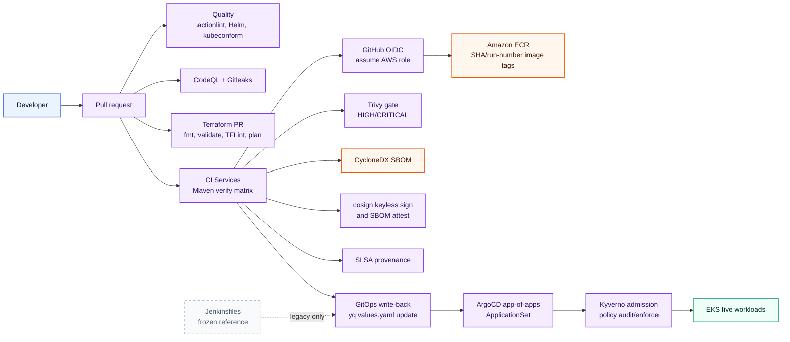
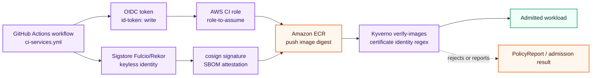
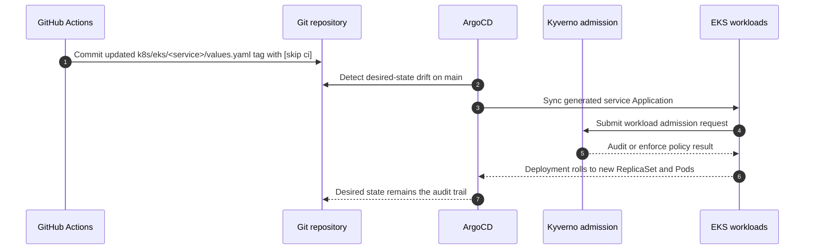

# CI/CD and Supply-Chain Layer

This layer owns the delivery chain: turning a reviewed commit into a tested image, a vulnerability-scanned artifact, a CycloneDX SBOM, a cosign keyless signature, SLSA provenance, and finally a GitOps state change reconciled into EKS. It decides how trust is established without static AWS keys, which checks gate promotion, and where delivery state is recorded.

## Workflow Inventory

| Workflow | Trigger | Jobs | Primary gates and outputs |
|---|---|---|---|
| `.github/workflows/ci-services.yml` (`CI Services`) | `push` to `main`; `pull_request`; skips `[skip ci]` commits. | `build-test-push`, `gitops-writeback`. | Maven `clean verify`, Docker Buildx push, Trivy HIGH/CRITICAL scan with `exit-code: 1`, CycloneDX SBOM, cosign keyless image signature, cosign SBOM attestation, SLSA provenance, Trivy SARIF upload, SBOM artifact upload, `yq` image-tag write-back. |
| `.github/workflows/terraform.yml` (`Terraform`) | PRs touching `terraform/**` or the workflow; `workflow_dispatch`. | `terraform-pr`, `terraform-apply`. | Terraform init/fmt/validate/plan, TFLint, Trivy config scan SARIF, sticky PR plan comment, manual apply through `terraform-apply` environment. |
| `.github/workflows/codeql.yml` (`CodeQL and Secrets`) | PRs touching `applications/**` or the workflow; push to `main`. | `codeql`, `gitleaks`. | Java CodeQL matrix over five services, Maven build with tests skipped for analysis, Gitleaks `8.21.2` PR-range scan with SARIF upload. |
| `.github/workflows/quality.yml` (`Quality`) | PRs targeting `main`. | `actionlint`, `helm-quality`. | actionlint `1.7.7`, Helm lint for five service charts plus Kyverno policies, Helm template render, kubeconform `0.6.7` strict validation. |



*The active delivery path is GitHub Actions to ECR to GitOps write-back to ArgoCD; Jenkins is shown only as a frozen reference path.*

## Supply-Chain Chain of Custody

| Stage | Source of truth | Control |
|---|---|---|
| AWS access | `aws-actions/configure-aws-credentials@v4` with `id-token: write`. | GitHub OIDC assumes the configured AWS role; no static AWS keys are stored in the workflow. |
| Image identity | `SHORT_SHA-GITHUB_RUN_NUMBER`. | Tags are traceable to commit and run number; verification should target the pushed digest. |
| Vulnerability gate | `aquasecurity/trivy-action@0.24.0`. | HIGH and CRITICAL image findings use `exit-code: '1'` with `ignore-unfixed: true`; SARIF is uploaded separately with `exit-code: '0'`. |
| SBOM | Trivy `format: cyclonedx`. | `sbom-<service>.cdx.json` is uploaded as a workflow artifact and used as the cosign attestation predicate. |
| Signature | `sigstore/cosign-installer@v3.8.1`. | `cosign sign` signs the ECR image digest keylessly with GitHub OIDC identity. |
| Provenance | `actions/attest-build-provenance@v2`. | SLSA provenance is pushed to the registry for the digest. |



*Trust is carried from GitHub OIDC into AWS role assumption and separately into Sigstore-backed image verification.*

## GitOps Handoff

`ci-services.yml` updates `k8s/eks/<service>/values.yaml` with `yq v4.44.3` after a successful `main` build. The write-back job runs one service at a time, commits with `[skip ci]`, and retries push/rebase up to five times. ArgoCD then reconciles through `platform-root` and the `eks-services` ApplicationSet.



*The deploy record is a Git commit, and the cluster changes only after ArgoCD reconciles that committed desired state through admission control.*

## Cosign Keyless Verification

Images pushed by GitHub Actions are signed keylessly with Sigstore cosign. Verify a published image by digest:

```bash
cosign verify \
        --certificate-identity-regexp "^https://github.com/.*/terraform-labs/.github/workflows/ci-services.yml@refs/heads/main$" \
        --certificate-oidc-issuer "https://token.actions.githubusercontent.com" \
        <aws_account_id>.dkr.ecr.<region>.amazonaws.com/<repository>@sha256:<digest>
```

Replace `<aws_account_id>`, `<region>`, `<repository>`, and `<digest>` with real values. Verification must target an image digest (`@sha256:...`), not a tag.

## GitOps Manifests

| Manifest | Role |
|---|---|
| `cicd/argocd/root-app-of-apps.yaml` | `platform-root` Application recursively syncs `cicd/argocd`, excludes itself, and enables prune, self-heal, and ServerSideApply. |
| `cicd/argocd/eks-services-applicationset.yaml` | Generates one Application per `k8s/eks/*` chart, deploys to a namespace matching the chart directory, enables `CreateNamespace=true`, ServerSideApply, prune, self-heal, and ignores Deployment replica drift. |
| `cicd/argocd/karpenter-application.yaml` | Installs the optional Karpenter chart into the `karpenter` namespace. |
| `cicd/argocd/kyverno-application.yaml` | Installs Kyverno from the upstream Helm chart. |
| `cicd/argocd/kyverno-policies-application.yaml` | Applies the local policy chart from `k8s/policy/kyverno`. |
| `cicd/argocd/prometheus-application.yaml` and `grafana-application.yaml` | Reconcile observability Helm charts into the monitoring namespace. |

## Legacy: Jenkins (Frozen)

The files under `cicd/jenkins` are retained as reference implementations only. They are not the active delivery path for this repository.

| Jenkinsfile | Legacy scope |
|---|---|
| `document-api-service-ci.Jenkinsfile` | Maven verify, image build/push, Trivy scan, GitOps values update for document API. |
| `document-processing-service-ci.Jenkinsfile` | Same legacy pipeline shape for the processing worker. |
| `document-processor-ci.Jenkinsfile` | Same legacy pipeline shape for the transitional upload service. |
| `document-review-service-ci.Jenkinsfile` | Same legacy pipeline shape for the review service. |
| `user-management-service-ci.Jenkinsfile` | Same legacy pipeline shape for identity service. |

Use the GitHub Actions workflows and ArgoCD manifests as the operational source of truth.
