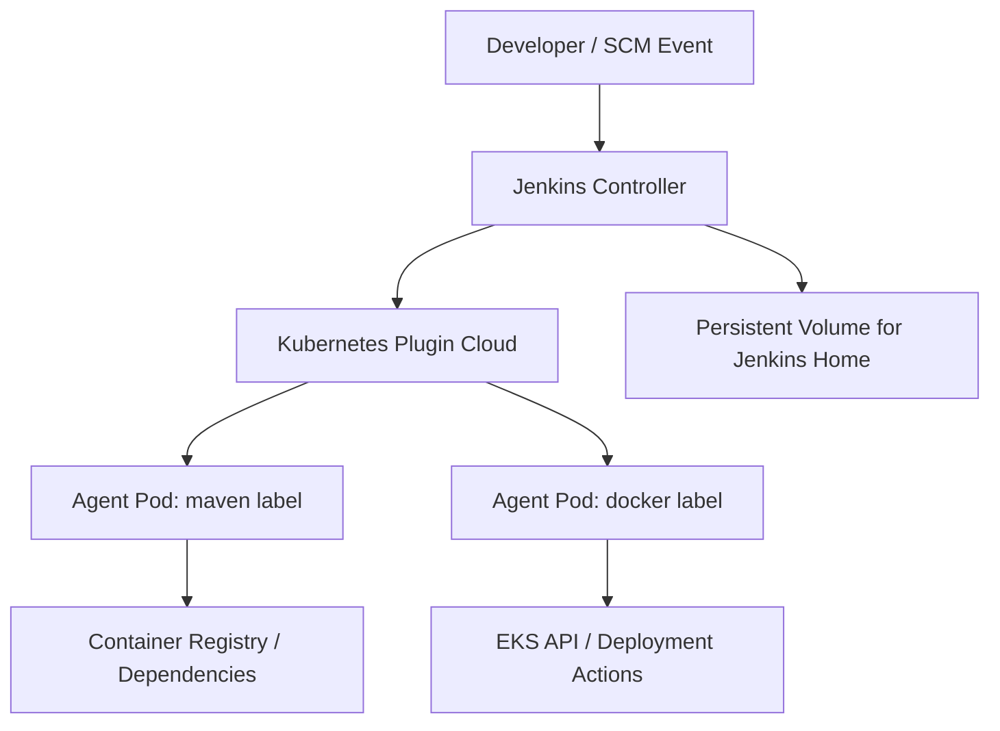

# Jenkins Delivery Platform — Dynamic Agents on EKS

This folder documents the CI/CD operating model for Terraform Labs.

The Jenkins runtime is deployed from the Helm chart in:

- `k8s/jenkins/dynamic-jenkins`

---

## 1. Design Goal

Run a lean Jenkins controller and create build agents only when pipelines require them.

Why this matters:

1. Lower idle cost.
2. Better build isolation.
3. Easier horizontal scaling.
4. Cleaner security boundary per build pod.

---

## 2. Architecture



---

## 3. Runtime Characteristics

Configured via JCasC in the Helm values:

- Controller executors set to `0` (controller is orchestration-only).
- Kubernetes cloud templates define dynamic agent pod types.
- Example labels currently available:
	- `maven`
	- `docker`

When a pipeline requests one of these labels, Jenkins spawns an ephemeral pod, runs the job, and the pod can terminate afterward.

---

## 4. Pipeline Pattern

```groovy
pipeline {
	agent none
	stages {
		stage('Build') {
			agent { label 'maven' }
			steps {
				sh 'mvn -version'
				sh 'mvn clean test'
			}
		}
		stage('Image') {
			agent { label 'docker' }
			steps {
				sh 'docker version'
			}
		}
	}
}
```

---

## 5. Deployment

Use the script from repo root:

```bash
./k8s/scripts/deploy-jenkins.sh
```

This script:

1. Adds/updates Helm repo.
2. Resolves chart dependencies.
3. Installs or upgrades Jenkins release.

---

## 6. Suggested Growth

1. Add agent templates for security scan, Terraform, and integration testing.
2. Add workload-specific service accounts with least privilege.
3. Add backup/restore policy for Jenkins persistent data.
4. Move shared pipeline logic into a governed shared library.

---

## 7. Cross-Documentation

- Root architecture portal: [README.md](../README.md)
- Kubernetes runtime architecture: [k8s/README.md](../k8s/README.md)
- Application design: [applications/README.md](../applications/README.md)
