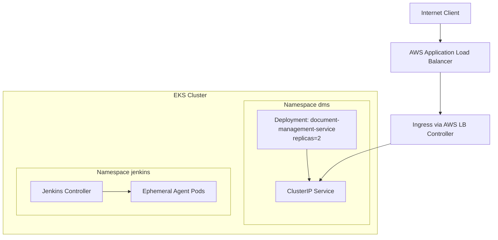
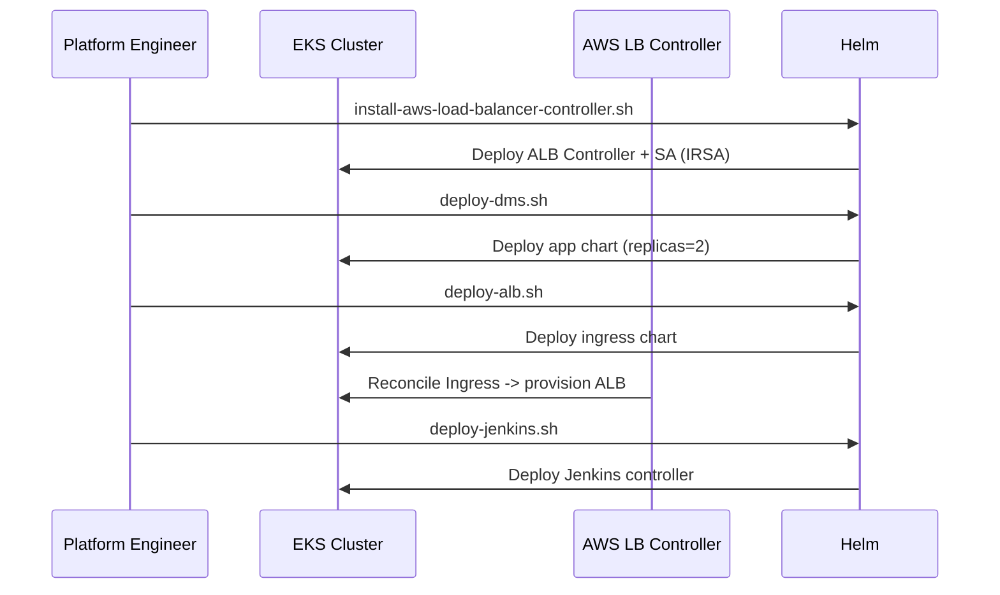

# Kubernetes Runtime — EKS Delivery Surface

This folder contains Kubernetes deployment assets for EKS using Helm.

---

## 1. Folder Structure

- `k8s/eks/document-management-service` — app deployment Helm chart.
- `k8s/eks/document-management-alb` — ALB ingress Helm chart.
- `k8s/jenkins/dynamic-jenkins` — Jenkins dynamic-agent Helm chart.
- `k8s/scripts` — deployment and prerequisite scripts.

---

## 2. Runtime Architecture

---

## 3. Helm Charts

### 3.1 Application chart

Path: `k8s/eks/document-management-service`

Core behavior:

- Deploys the service as a Kubernetes Deployment.
- Default `replicaCount: 2`.
- Exposes app through ClusterIP service on port 80 -> target 8080.

### 3.2 ALB chart (separate)

Path: `k8s/eks/document-management-alb`

Core behavior:

- Creates Ingress object with AWS ALB annotations.
- Targets the application service.
- Supports health check path, target type, scheme, cert ARN.

This separation lets teams evolve app rollout and edge traffic rules independently.

---

## 4. Deployment Scripts

Path: `k8s/scripts`

- `install-aws-load-balancer-controller.sh` — installs controller with IRSA service account.
- `deploy-dms.sh` — deploys application chart.
- `deploy-alb.sh` — deploys ALB chart.
- `deploy-jenkins.sh` — deploys dynamic Jenkins chart.
- `deploy-all.sh` — executes full stack deployment sequence.

---

## 5. Delivery Sequence

---

## 6. Operational Notes

1. Ensure AWS Load Balancer Controller IAM role is configured before ingress deployment.
2. Keep application and ingress Helm values versioned per environment.
3. Keep Jenkins in a separate namespace for operational isolation.
4. Use chart value overlays for dev/stage/prod growth.

---

## 7. Reference Links

- Root architecture portal: [README.md](../README.md)
- Application design: [applications/README.md](../applications/README.md)
- Delivery platform details: [jenkins/README.md](../jenkins/README.md)
