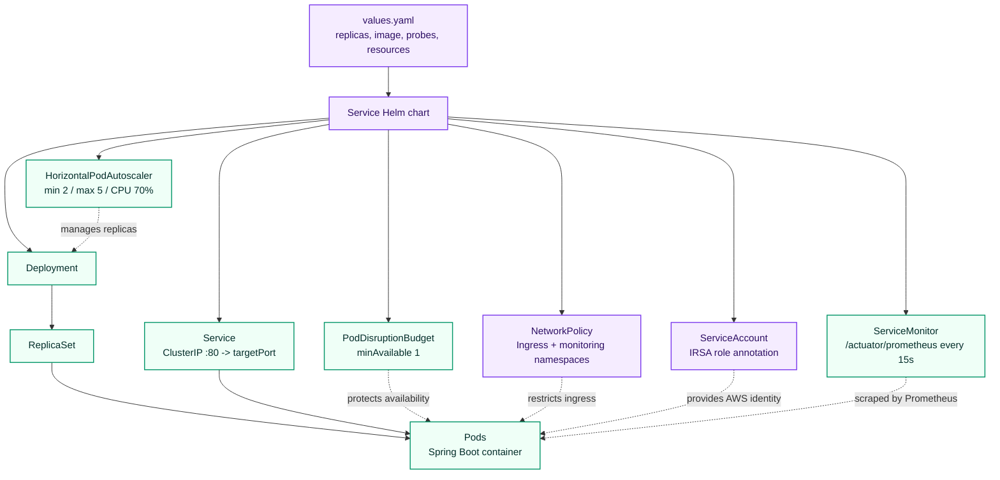
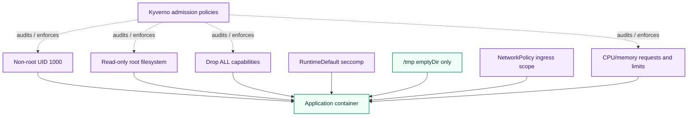
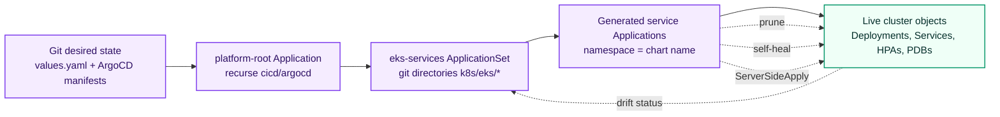

# Kubernetes Runtime Layer

This layer owns the runtime contract for the platform: how service images become replicated, hardened, observable pods on EKS, and how platform controllers such as ArgoCD, Karpenter, Kyverno, Prometheus, and Grafana are installed. It decides pod shape, rollout safety, network posture, ServiceAccount identity, health probes, autoscaling, and the handoff between bootstrap scripts and GitOps reconciliation.

## Chart Catalogue

| Chart | Purpose | Templates or rendered resources |
|---|---|---|
| `k8s/eks/document-api-service` | Public document metadata and presigned URL API on container port `8082`. | `_helpers.tpl`, `deployment.yaml`, `hpa.yaml`, `networkpolicy.yaml`, `pdb.yaml`, `service.yaml`, `serviceaccount.yaml`, `servicemonitor.yaml` |
| `k8s/eks/document-processing-service` | Internal SQS/S3/DynamoDB processing worker on container port `8083`. | `_helpers.tpl`, `deployment.yaml`, `hpa.yaml`, `networkpolicy.yaml`, `pdb.yaml`, `service.yaml`, `serviceaccount.yaml`, `servicemonitor.yaml` |
| `k8s/eks/document-processor` | Transitional S3 upload service on container port `8080`. | `_helpers.tpl`, `deployment.yaml`, `networkpolicy.yaml`, `service.yaml`, `serviceaccount.yaml` |
| `k8s/eks/document-review-service` | Review queue, correction, decision, and audit API on container port `8084`. | `_helpers.tpl`, `deployment.yaml`, `hpa.yaml`, `networkpolicy.yaml`, `pdb.yaml`, `service.yaml`, `serviceaccount.yaml`, `servicemonitor.yaml` |
| `k8s/eks/user-management-service` | Identity, JWT, role, and refresh-token service on container port `8081`. | `_helpers.tpl`, `deployment.yaml`, `hpa.yaml`, `networkpolicy.yaml`, `pdb.yaml`, `service.yaml`, `serviceaccount.yaml`, `servicemonitor.yaml` |
| `k8s/argocd/argocd` | Wrapper chart for Argo CD `2.13.3`. | Official `argo-cd` Helm dependency `>=7.0.0 <8.0.0`; no local templates. |
| `k8s/karpenter/karpenter` | Optional node provisioning layer when `karpenter_enabled` is enabled in Terraform. | `ec2nodeclass.yaml`, `nodepool.yaml` |
| `k8s/policy/kyverno` | Platform policy pack applied by ArgoCD. | `disallow-latest-tag.yaml`, `require-irsa-annotation.yaml`, `require-resources.yaml`, `require-security-context.yaml`, `verify-images-gha-cosign.yaml` |

*A service chart expands one versioned image and one values file into the runtime objects Kubernetes uses to run, scale, expose, observe, and constrain the workload.*

## Runtime Hardening

The four primary service charts share a hardened baseline in `values.yaml` and `deployment.yaml`. The `document-processor` chart carries the same Deployment, ServiceAccount, Service, and NetworkPolicy foundation, but does not currently include HPA, PDB, or ServiceMonitor templates.

| Runtime control | Current chart value |
|---|---|
| Replicas | `replicaCount: 2` for every service chart. |
| Rollout strategy | RollingUpdate with `maxSurge: 25%` and `maxUnavailable: 25%`. |
| Pod security context | `runAsNonRoot: true`, `runAsUser: 1000`, `fsGroup: 1000`, `seccompProfile.type: RuntimeDefault`. |
| Container security context | `allowPrivilegeEscalation: false`, `readOnlyRootFilesystem: true`, drop `ALL` Linux capabilities. |
| Writable filesystem | Only `/tmp` is mounted as an `emptyDir`. |
| Placement | Topology spread across `topology.kubernetes.io/zone` and `kubernetes.io/hostname`. |
| Resources | Requests `100m` CPU and `256Mi` memory; limits `500m` CPU and `512Mi` memory. |
| Health model | Startup, readiness, and liveness probes use `/actuator/health/readiness` and `/actuator/health/liveness`. |
| NetworkPolicy | Conditional chart feature with ingress from `ingress-nginx`, `kube-system`, and Prometheus namespace `monitoring`. |
| ServiceAccount identity | `eks.amazonaws.com/role-arn` annotation is present in each service values file and should be replaced from Terraform outputs. |

```mermaid
%%{init: {'theme':'default','flowchart':{'useMaxWidth':true,'htmlLabels':true}}}%%
flowchart LR
	Internet["Client / external caller"]:::edge --> ALB["Application Load Balancer\npublic subnets"]:::edge
	ALB -->|"HTTP/HTTPS :80/:443"| ALBSG["ALB security group"]:::edge
	ALBSG -->|"egress to NodePort range"| NodeSG["EKS node security group\nallows ALB SG :30000-32767"]:::control
	NodeSG --> NodePort["NodePort on worker node\nkube-proxy datapath"]:::runtime
	NodePort --> Service["Kubernetes Service\nClusterIP :80 -> targetPort"]:::runtime
	Service --> Pod["Pod container port\n8080 / 8081 / 8082 / 8083 / 8084"]:::runtime
	Pod -. AWS identity .-> IRSA["ServiceAccount + IRSA"]:::control

	classDef edge fill:#EAF4FF,stroke:#1D4ED8,color:#0F172A,stroke-width:1.5px;
	classDef runtime fill:#EFFFF7,stroke:#059669,color:#052E2B,stroke-width:1.5px;
	classDef data fill:#FFF7ED,stroke:#EA580C,color:#431407,stroke-width:1.5px;
	classDef control fill:#F5ECFF,stroke:#7C3AED,color:#2E1065,stroke-width:1.5px;
	classDef legacy fill:#F8FAFC,stroke:#94A3B8,color:#475569,stroke-width:1px,stroke-dasharray: 5 5;
```

*Ingress crosses an explicit ALB-to-node security-group boundary before kube-proxy routes traffic to the selected service pod.*

*The pod contract layers Kubernetes runtime controls with Kyverno admission checks so the hardening is visible both before and after scheduling.*

## Deployment Model

Bootstrap scripts are still useful for first-cluster setup and operator-driven installs. Long-lived service delivery should move through GitOps so desired state is committed, reviewed, reconciled, and self-healed.

| Path | Source files | Use when | Ownership model |
|---|---|---|---|
| Script bootstrap | `k8s/scripts/deploy-argocd.sh`, `deploy-prometheus.sh`, `deploy-grafana.sh`, `install-aws-load-balancer-controller.sh`, `deploy-all.sh` | Bringing up a fresh cluster or installing foundational controllers. | Operator runs the script against a selected cluster context. |
| Service script deploy | `k8s/scripts/deploy-document-api.sh`, `deploy-document-processing.sh`, `deploy-document-processor.sh`, `deploy-document-review.sh`, `deploy-user-management.sh` | Manual service deployment or break-glass verification. | Operator renders/applies one chart directly. |
| GitOps reconciliation | `cicd/argocd/root-app-of-apps.yaml`, `cicd/argocd/eks-services-applicationset.yaml` | Normal steady-state delivery after CI writes a new image tag. | ArgoCD owns prune, self-heal, namespace creation, and server-side apply. |

*GitOps owns steady-state convergence: Git is the input, ArgoCD computes the generated Applications, and live Kubernetes objects are reconciled with prune and self-heal enabled.*

## Values Reference

| Values path | Meaning | Current pattern |
|---|---|---|
| `replicaCount` | Desired Deployment replicas before HPA adjustment. | `2` in every service chart. |
| `image.repository` | ECR repository used by the chart. | `your-account-id.dkr.ecr.your-region.amazonaws.com/<service>`. |
| `image.tag` | Runtime image tag written by CI/GitOps. | `REPLACED_BY_CI`. |
| `image.pullPolicy` | Container image pull behavior. | `IfNotPresent`. |
| `service.type` | Kubernetes Service type. | `ClusterIP`. |
| `service.port` | Service port. | `80` for the service charts. |
| `service.targetPort` | Container port. | `8080`, `8081`, `8082`, `8083`, or `8084` depending on service. |
| `resources.requests` / `resources.limits` | Scheduler reservation and runtime ceiling. | `100m/256Mi` requests and `500m/512Mi` limits. |
| `hpa.enabled` | Enables HPA template. | `true` for the four primary services; absent from `document-processor`. |
| `hpa.minReplicas` / `hpa.maxReplicas` | Autoscaling range. | `2` to `5`. |
| `hpa.targetCPUUtilizationPercentage` | CPU target. | `70`. |
| `pdb.enabled` / `pdb.minAvailable` | Voluntary disruption protection. | `true` and `1` for the four primary services. |
| `networkPolicy.enabled` | Emits an ingress NetworkPolicy. | `false` by default; namespaces listed for ingress and Prometheus. |
| `serviceAccount.annotations.eks.amazonaws.com/role-arn` | IRSA role binding. | Placeholder ARN to be replaced from Terraform outputs. |
| `env` | Runtime environment variables. | Includes service port, AWS region, OTLP endpoint on the four primary service charts, and service-specific AWS resources. |

## Operating Notes

- Do not commit generated Helm dependencies under `charts/`.
- Jenkins assets under `k8s/jenkins/dynamic-jenkins` are retained as a legacy reference, not the active delivery path.
- Prefer the ArgoCD app-of-apps and ApplicationSet path for steady-state service delivery.
