# Karpenter Setup

This directory contains Karpenter deployment assets:

- Wrapper Helm chart: `k8s/karpenter/karpenter`
- Karpenter NodeClass and NodePool manifests in chart templates
- ArgoCD application: `cicd/argocd/karpenter-application.yaml`

## Why Karpenter here

Terraform keeps Karpenter optional behind `karpenter_enabled`; the current `terraform/terraform.tfvars` value is `false`. Enable it when the managed node groups are no longer enough for bursty, mixed-capacity workloads and the platform needs just-in-time nodes with consolidation. Keep at least one managed bootstrap node group so the Karpenter controller itself has a stable place to run.

```mermaid
%%{init: {'theme':'default','flowchart':{'useMaxWidth':true,'htmlLabels':true}}}%%
flowchart LR
   Pod["Unschedulable Pod"]:::runtime --> Karpenter["Karpenter controller"]:::control
   Karpenter --> NodePool["NodePool\ninstance categories c/m/r\nspot or on-demand"]:::control
   NodePool --> EC2Class["EC2NodeClass\nAL2023"]:::control
   EC2Class --> EC2["New EC2 worker node"]:::runtime
   EC2 --> Join["Node joins EKS"]:::runtime
   Join --> Scheduled["Pod scheduled"]:::runtime
   Scheduled -. empty or underutilized .-> Consolidation["Consolidation\nWhenEmptyOrUnderutilized after 30s"]:::control
   Consolidation -. deprovisions .-> EC2

   classDef edge fill:#EAF4FF,stroke:#1D4ED8,color:#0F172A,stroke-width:1.5px;
   classDef runtime fill:#EFFFF7,stroke:#059669,color:#052E2B,stroke-width:1.5px;
   classDef data fill:#FFF7ED,stroke:#EA580C,color:#431407,stroke-width:1.5px;
   classDef control fill:#F5ECFF,stroke:#7C3AED,color:#2E1065,stroke-width:1.5px;
   classDef legacy fill:#F8FAFC,stroke:#94A3B8,color:#475569,stroke-width:1px,stroke-dasharray: 5 5;
```

*Karpenter reacts to unschedulable pods, chooses capacity through NodePool and EC2NodeClass constraints, and later consolidates underused nodes.*

## NodePool and EC2NodeClass reference

| Setting | Current value | Source |
|---|---|---|
| `nodePool.name` | `default` | `values.yaml` |
| `nodePool.limits.cpu` | `100` | `values.yaml` |
| `nodePool.limits.memory` | `200Gi` | `values.yaml` |
| Instance categories | `c`, `m`, `r` | `nodepool.yaml` from `nodePool.requirements.instanceCategories` |
| Capacity types | `on-demand`, `spot` | `nodepool.yaml` from `nodePool.requirements.capacityTypes` |
| Disruption policy | `WhenEmptyOrUnderutilized` | `nodepool.yaml` |
| Consolidation delay | `30s` | `nodepool.yaml` |
| `ec2NodeClass.amiFamily` | `AL2023` | `values.yaml` / `ec2nodeclass.yaml` |
| Subnet selector tag | `karpenter.sh/discovery: my-app-eks` | `values.yaml` / `ec2nodeclass.yaml` |
| Security group selector tag | `karpenter.sh/discovery: my-app-eks` | `values.yaml` / `ec2nodeclass.yaml` |

## Prerequisites

1. Terraform applied with `karpenter_enabled = true`.
2. Populate `k8s/karpenter/karpenter/values.yaml` placeholders:
   - `karpenter.settings.clusterEndpoint`
   - `karpenter.serviceAccount.annotations.eks.amazonaws.com/role-arn`
   - `ec2NodeClass.role`
3. Ensure VPC subnets and node security groups have `karpenter.sh/discovery=<cluster-name>` tags.

## Notes

- Keep at least one managed bootstrap node group for Karpenter controller availability.
- Karpenter provisioning can then scale additional AL2023 worker nodes via NodePool/EC2NodeClass.
