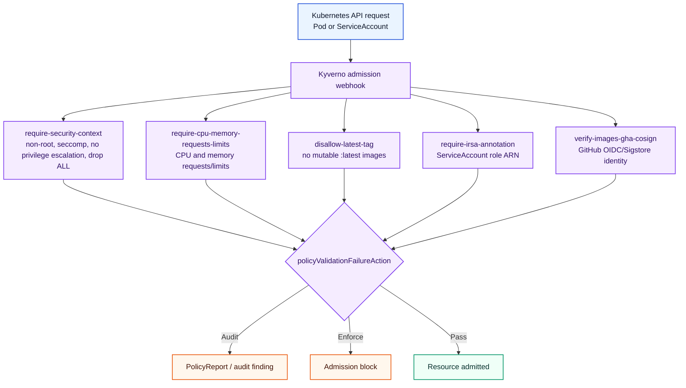

# Kyverno Policies (Audit-first)

This chart deploys cluster-wide Kyverno `ClusterPolicy` resources for baseline runtime and supply-chain enforcement.

*Every policy uses the same validation failure action, so the platform can run audit-first and later flip the pack to enforcement from one values key.*

## Included policies

- Require non-root execution and restricted container security context.
- Require CPU and memory requests and limits.
- Disallow mutable `:latest` image tags.
- Require `eks.amazonaws.com/role-arn` annotation on service accounts in AWS-access namespaces.
- Verify cosign keyless signatures for ECR images (GitHub OIDC/Sigstore identity).

## Policy table

| Policy name | What it checks | Match scope | Default action |
|---|---|---|---|
| `require-security-context` | Pod `runAsNonRoot: true`, `seccompProfile.type: RuntimeDefault`, container `allowPrivilegeEscalation: false`, and `capabilities.drop: ALL`. | `Pod` | `Audit` from `policyValidationFailureAction` |
| `require-cpu-memory-requests-limits` | Every container defines CPU and memory requests and limits. | `Pod` | `Audit` from `policyValidationFailureAction` |
| `disallow-latest-tag` | Container image strings must not contain `:latest`. | `Pod` | `Audit` from `policyValidationFailureAction` |
| `require-irsa-annotation` | ServiceAccounts include `eks.amazonaws.com/role-arn: arn:aws:iam::*:role/*`. | `ServiceAccount` in `document-api`, `document-processing`, `document-review`, `document-processor`, `user-management` namespaces. | `Audit` from `policyValidationFailureAction` |
| `verify-images-gha-cosign` | ECR images match keyless signatures from issuer `https://token.actions.githubusercontent.com` and subject regex `https://github.com/.*/terraform-labs/.github/workflows/ci-services.yml@refs/heads/main`. | `Pod`; `background: false`; ECR image references only. | `Audit` from `policyValidationFailureAction` |

## Audit -> Enforce

Policies start in `Audit` mode by default:

- `policyValidationFailureAction: Audit`

To switch to enforcement, set:

- `policyValidationFailureAction: Enforce`

in [values.yaml](values.yaml) and sync the ArgoCD application.
