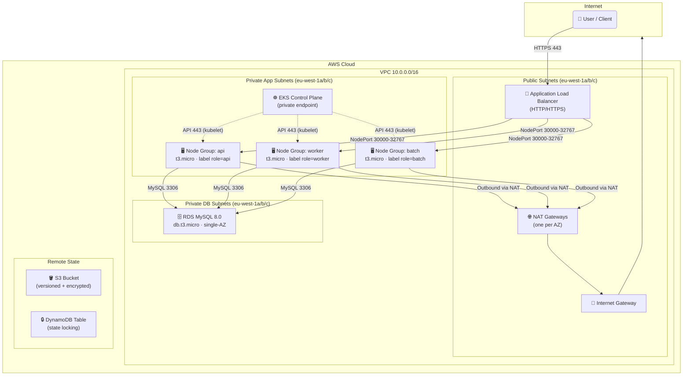
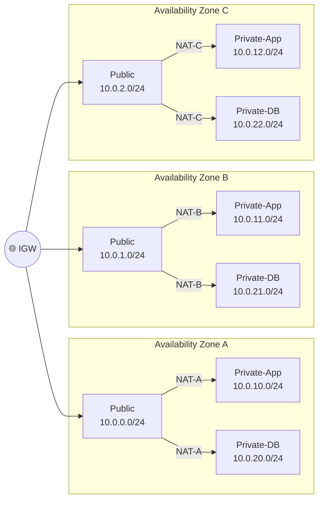
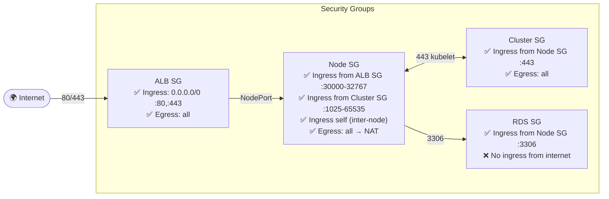
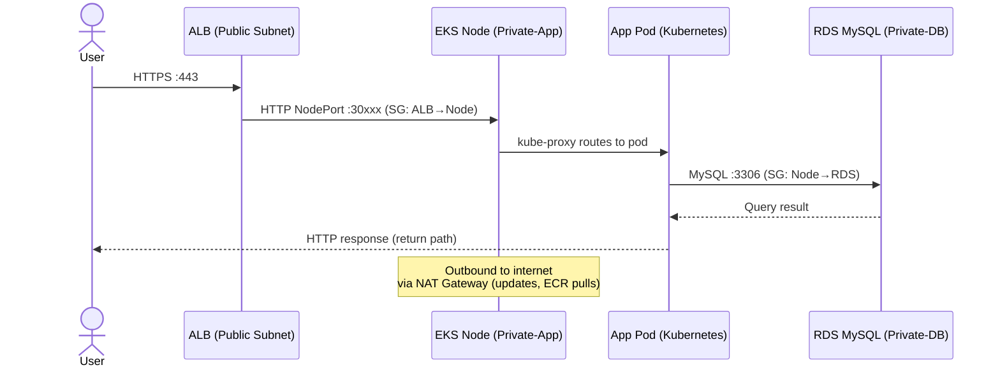
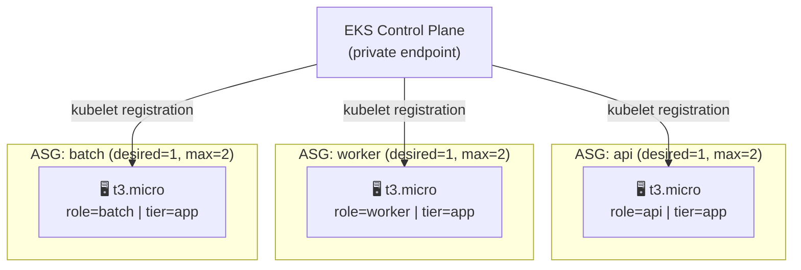
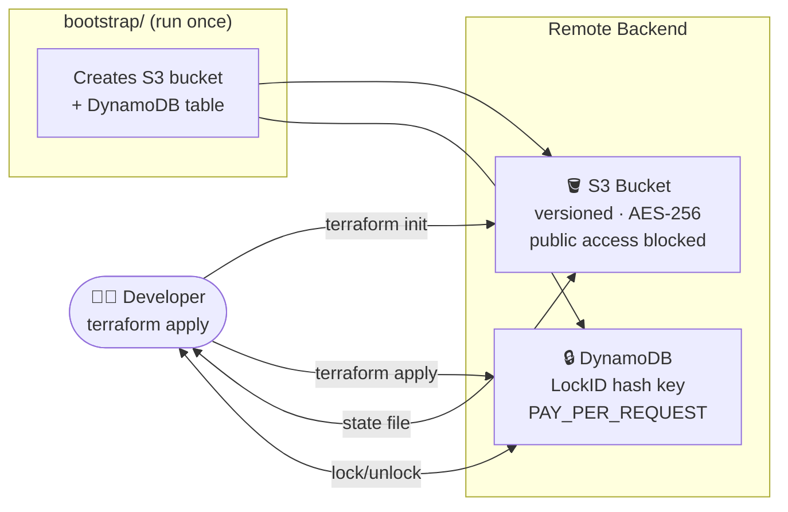

Author: Arunasalam Govindasamy

# Terraform Labs — AWS Multi-Tier Architecture

> Fully modular Terraform code that provisions a production-style (free-tier friendly) AWS environment: **VPC → EKS (self-managed) → RDS MySQL**, fronted by an **Application Load Balancer** and backed by **S3 + DynamoDB** remote state.

---

## Table of Contents

1. [High-Level Architecture](#1-high-level-architecture)
2. [Network Layout](#2-network-layout)
3. [Security Group Flow](#3-security-group-flow)
4. [Traffic Flow — Request to Database](#4-traffic-flow--request-to-database)
5. [Module Structure](#5-module-structure)
6. [EKS Node Groups](#6-eks-node-groups)
7. [Remote State Design](#7-remote-state-design)
8. [Deployment Guide](#8-deployment-guide)
9. [Cost Notes (Free Tier)](#9-cost-notes-free-tier)

---

## 1. High-Level Architecture



---

## 2. Network Layout

Each **Availability Zone** gets exactly **3 subnets** — one in each tier:



| Tier | Subnet | Route to Internet | Contains |
|------|--------|-------------------|----------|
| **Public** | `10.0.{0,1,2}.0/24` | Direct via IGW | ALB, NAT Gateways |
| **Private-App** | `10.0.{10,11,12}.0/24` | Outbound via NAT | EKS nodes (all 3 groups) |
| **Private-DB** | `10.0.{20,21,22}.0/24` | None (isolated) | RDS MySQL |

---

## 3. Security Group Flow

Security Groups enforce **least-privilege** at every hop. No CIDR-based rules exist between tiers — all cross-tier rules reference SG IDs.



---

## 4. Traffic Flow — Request to Database



---

## 5. Module Structure

```
terraform/
├── backend.tf              # S3 + DynamoDB remote state backend
├── versions.tf             # AWS provider ~> 5.0, Terraform >= 1.9
├── main.tf                 # Root caller — ALB SG, VPC, EKS, ECR, S3(KMS), RDS modules
├── variables.tf            # All input variables
├── outputs.tf              # Key resource IDs and endpoints
├── terraform.tfvars        # Environment values
│
├── bootstrap/              # ① Run FIRST — creates S3 bucket + DynamoDB table
│   ├── main.tf
│   ├── variables.tf
│   ├── outputs.tf
│   └── terraform.tfvars
│
└── modules/
	├── vpc/                # VPC, subnets (public/app/db), IGW, NAT GW, route tables, DB subnet group
	│   ├── main.tf
	│   ├── variables.tf
	│   └── outputs.tf
	│
	├── eks/                # EKS cluster, IAM roles, SGs, launch templates, ASGs
	│   ├── main.tf
	│   ├── iam.tf
	│   ├── variables.tf
	│   └── outputs.tf
	│
	└── rds/                # RDS MySQL, SG, parameter group, DB subnet group
		├── main.tf
		├── variables.tf
		└── outputs.tf
	│
	└── s3/                 # Document bucket with KMS key, public access blocked, SSE-KMS default encryption
		├── main.tf
		├── variables.tf
		└── outputs.tf
```

---

## 6. EKS Node Groups

Three **self-managed node groups** are provisioned via EC2 Launch Templates + Auto Scaling Groups. Labels are passed from `terraform.tfvars` down through the root module into the EKS module and injected as `--node-labels` in the bootstrap userdata.



| Group | Instance | Desired | Min | Max | Labels |
|-------|----------|---------|-----|-----|--------|
| `api` | t3.micro | 1 | 1 | 2 | `role=api, tier=app` |
| `worker` | t3.micro | 1 | 1 | 2 | `role=worker, tier=app` |
| `batch` | t3.micro | 1 | 0 | 2 | `role=batch, tier=app` |

All label **values** are configurable from `terraform.tfvars` via `eks_node_groups[*].labels`.

---

## 7. Remote State Design



| Resource | Setting | Purpose |
|----------|---------|---------|
| S3 versioning | Enabled | Roll back to any previous state |
| S3 encryption | AES-256 | State at-rest encryption |
| S3 public access | Blocked | No accidental public exposure |
| DynamoDB billing | PAY_PER_REQUEST | No capacity planning needed |
| DynamoDB PITR | Enabled | Point-in-time recovery for lock table |

---

## 8. Deployment Guide

### Prerequisites
- Terraform >= 1.9
- AWS CLI configured (`aws configure`)
- Sufficient IAM permissions (EKS, EC2, RDS, VPC, IAM, S3, DynamoDB)

### Step 1 — Bootstrap remote state (run once)

```bash
cd terraform/bootstrap
# Edit terraform.tfvars — set a globally unique state_bucket_name
terraform init
terraform apply
```

### Step 2 — Update backend.tf in terraform/

Copy the outputs from Step 1 into `backend.tf`:

```hcl
backend "s3" {
  bucket         = "<state_bucket_name from bootstrap output>"
  key            = "terraform-labs/terraform.tfstate"
  region         = "eu-west-1"
  encrypt        = true
  dynamodb_table = "terraform-state-locks"
}
```

### Step 3 — Deploy the full stack

```bash
cd terraform
export TF_VAR_db_password="YourStrongPassword123!"
terraform init    # connects to S3 backend
terraform plan
terraform apply
```

This root stack provisions an ECR repository for document-processor images. Useful outputs after apply:

```bash
terraform output -raw document_processor_ecr_repository_name
terraform output -raw document_processor_ecr_repository_url
terraform output -raw document_processor_ecr_repository_arn
```

Recommended CI handoff:

1. Use `document_processor_ecr_repository_url` as the Jenkins `ECR_REPOSITORY_URI` parameter.
2. Keep repository naming configurable through `document_processor_ecr_repository_name` in `terraform.tfvars`.
3. Adjust `document_processor_ecr_image_tag_mutability`, `document_processor_ecr_image_scan_on_push`, and `document_processor_ecr_max_image_count` per environment.

### Step 4 — Configure kubectl

```bash
aws eks update-kubeconfig \
  --region eu-west-1 \
  --name $(terraform output -raw eks_cluster_name)
kubectl get nodes --show-labels
```

---

## 9. Cost Notes (Free Tier)

| Resource | Free-tier config | Potential cost if exceeded |
|----------|-----------------|---------------------------|
| EKS Control Plane | **$0.10/hr** — not free tier | ~$72/month |
| EC2 Nodes | t3.micro × 3 — 750 hrs/month free | Minimal above free tier |
| RDS | db.t3.micro, 20 GiB gp2 — free tier | Minimal above free tier |
| NAT Gateway | **Not free tier** — $0.045/hr + data | Use `single_nat_gateway = true` in dev |
| S3 State Bucket | 5 GB free | Negligible |
| DynamoDB Lock Table | 25 GB + 25 WCU/RCU free | Negligible (PAY_PER_REQUEST) |

> **Tip:** Set `single_nat_gateway = true` and reduce `desired_size` to `0` for idle environments to minimise costs.
